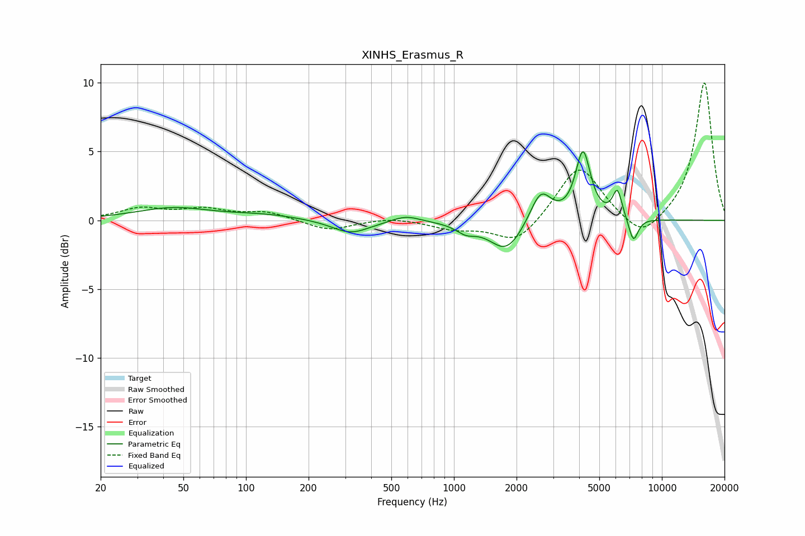

# XINHS_Erasmus_R
See [usage instructions](https://github.com/jaakkopasanen/AutoEq#usage) for more options and info.

### Parametric EQs
Apply preamp of -5.1 dB when using parametric equalizer.

|   # | Type    |   Fc (Hz) |    Q |   Gain (dB) |
|-----|---------|-----------|------|-------------|
|   1 | Peaking |        45 | 0.8  |         0.9 |
|   2 | Peaking |       124 | 0.83 |         0.3 |
|   3 | Peaking |       319 | 1.55 |        -1   |
|   4 | Peaking |       588 | 2.1  |         0.5 |
|   5 | Peaking |      1141 | 2.99 |        -0.6 |
|   6 | Peaking |      1786 | 1.75 |        -2.3 |
|   7 | Peaking |      2613 | 2.78 |         2.4 |
|   8 | Peaking |      4175 | 3.96 |         4.9 |
|   9 | Peaking |      6110 | 5.98 |         2   |
|  10 | Peaking |      7293 | 5.82 |        -1.8 |

### Fixed Band EQs
When using fixed band (also called graphic) equalizer, apply preamp of **-10.1 dB** (if available) and set gains manually with these parameters.

|   # | Type    |   Fc (Hz) |    Q |   Gain (dB) |
|-----|---------|-----------|------|-------------|
|   1 | Peaking |        31 | 1.41 |         0.8 |
|   2 | Peaking |        62 | 1.41 |         0.7 |
|   3 | Peaking |       125 | 1.41 |         0.6 |
|   4 | Peaking |       250 | 1.41 |        -0.8 |
|   5 | Peaking |       500 | 1.41 |         0.2 |
|   6 | Peaking |      1000 | 1.41 |        -0.6 |
|   7 | Peaking |      2000 | 1.41 |        -1.8 |
|   8 | Peaking |      4000 | 1.41 |         4.1 |
|   9 | Peaking |      8000 | 1.41 |        -1.6 |
|  10 | Peaking |     16000 | 1.41 |        10.1 |

### Graphs

