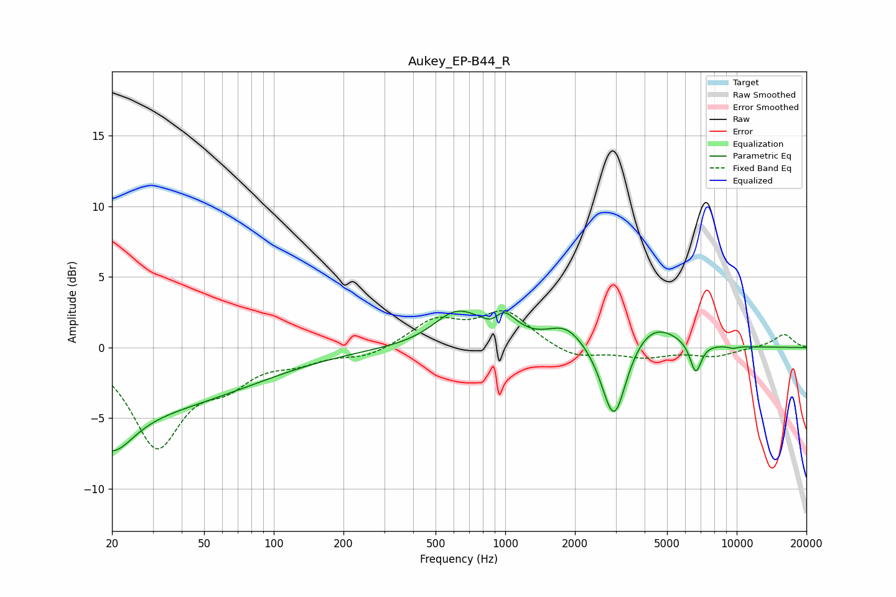

# Aukey_EP-B44_R
See [usage instructions](https://github.com/jaakkopasanen/AutoEq#usage) for more options and info.

### Parametric EQs
Apply preamp of -2.7 dB when using parametric equalizer.

|   # | Type    |   Fc (Hz) |    Q |   Gain (dB) |
|-----|---------|-----------|------|-------------|
|   1 | Peaking |        20 | 0.22 |        -4.4 |
|   2 | Peaking |        20 | 1.57 |        -2.9 |
|   3 | Peaking |       614 | 1.4  |         2.3 |
|   4 | Peaking |       886 | 3.51 |        -1.2 |
|   5 | Peaking |       951 | 2.36 |         2.4 |
|   6 | Peaking |      1828 | 1.76 |         1.4 |
|   7 | Peaking |      2950 | 2.67 |        -5.9 |
|   8 | Peaking |      4310 | 1.28 |         1.9 |
|   9 | Peaking |      6649 | 5.56 |        -2.2 |
|  10 | Peaking |      9638 | 6    |        -0.2 |

### Fixed Band EQs
When using fixed band (also called graphic) equalizer, apply preamp of **-2.7 dB** (if available) and set gains manually with these parameters.

|   # | Type    |   Fc (Hz) |    Q |   Gain (dB) |
|-----|---------|-----------|------|-------------|
|   1 | Peaking |        31 | 1.41 |        -6.8 |
|   2 | Peaking |        62 | 1.41 |        -2   |
|   3 | Peaking |       125 | 1.41 |        -0.8 |
|   4 | Peaking |       250 | 1.41 |        -0.7 |
|   5 | Peaking |       500 | 1.41 |         1.9 |
|   6 | Peaking |      1000 | 1.41 |         2.4 |
|   7 | Peaking |      2000 | 1.41 |        -0.8 |
|   8 | Peaking |      4000 | 1.41 |        -0.6 |
|   9 | Peaking |      8000 | 1.41 |        -0.6 |
|  10 | Peaking |     16000 | 1.41 |         1   |

### Graphs

