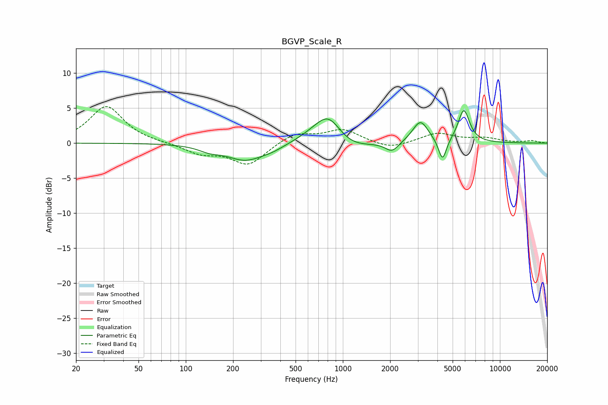

# BGVP_Scale_R
See [usage instructions](https://github.com/jaakkopasanen/AutoEq#usage) for more options and info.

### Parametric EQs
Apply preamp of -4.7 dB when using parametric equalizer.

|   # | Type    |   Fc (Hz) |    Q |   Gain (dB) |
|-----|---------|-----------|------|-------------|
|   1 | Peaking |       142 | 2.08 |        -0.7 |
|   2 | Peaking |       239 | 1.21 |        -2.3 |
|   3 | Peaking |       355 | 1.71 |        -0.6 |
|   4 | Peaking |       670 | 1.29 |         1   |
|   5 | Peaking |       815 | 1.7  |         3.8 |
|   6 | Peaking |      1075 | 1.19 |        -1.4 |
|   7 | Peaking |      2058 | 3.34 |        -1.4 |
|   8 | Peaking |      3117 | 2.84 |         3.1 |
|   9 | Peaking |      4310 | 5.52 |        -3.2 |
|  10 | Peaking |      5890 | 3.82 |         4.7 |

### Fixed Band EQs
When using fixed band (also called graphic) equalizer, apply preamp of **-5.3 dB** (if available) and set gains manually with these parameters.

|   # | Type    |   Fc (Hz) |    Q |   Gain (dB) |
|-----|---------|-----------|------|-------------|
|   1 | Peaking |        31 | 1.41 |         5.3 |
|   2 | Peaking |        62 | 1.41 |         0   |
|   3 | Peaking |       125 | 1.41 |        -1.4 |
|   4 | Peaking |       250 | 1.41 |        -3.1 |
|   5 | Peaking |       500 | 1.41 |         1.5 |
|   6 | Peaking |      1000 | 1.41 |         1.9 |
|   7 | Peaking |      2000 | 1.41 |        -0.9 |
|   8 | Peaking |      4000 | 1.41 |         1.4 |
|   9 | Peaking |      8000 | 1.41 |         0.6 |
|  10 | Peaking |     16000 | 1.41 |         0.3 |

### Graphs

