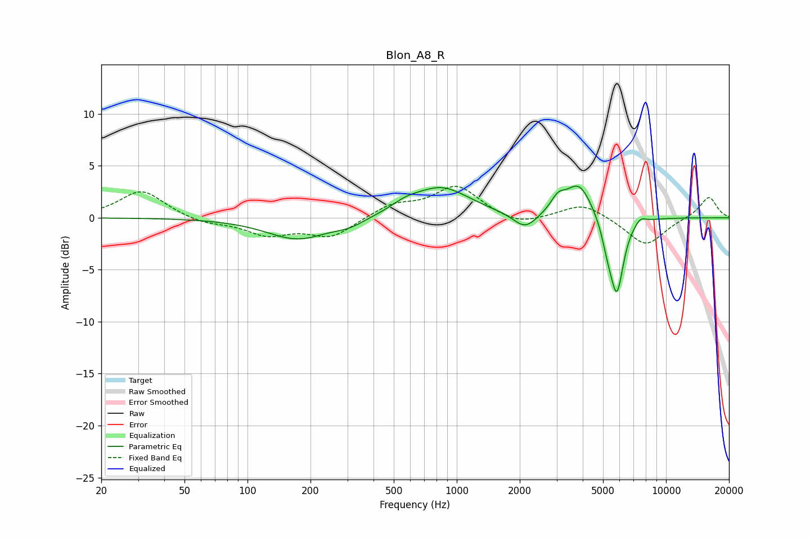

# Blon_A8_R
See [usage instructions](https://github.com/jaakkopasanen/AutoEq#usage) for more options and info.

### Parametric EQs
Apply preamp of -3.1 dB when using parametric equalizer.

|   # | Type    |   Fc (Hz) |    Q |   Gain (dB) |
|-----|---------|-----------|------|-------------|
|   1 | Peaking |       174 | 0.95 |        -2.1 |
|   2 | Peaking |       308 | 1.98 |        -0.6 |
|   3 | Peaking |       568 | 2.01 |         0.7 |
|   4 | Peaking |       845 | 1.04 |         2.9 |
|   5 | Peaking |      2122 | 2.5  |        -1.6 |
|   6 | Peaking |      3045 | 4.07 |         1.3 |
|   7 | Peaking |      3838 | 2.22 |         3.3 |
|   8 | Peaking |      5255 | 5.08 |        -1.8 |
|   9 | Peaking |      5825 | 4.27 |        -7.1 |
|  10 | Peaking |      7532 | 5.17 |         0.6 |

### Fixed Band EQs
When using fixed band (also called graphic) equalizer, apply preamp of **-3.1 dB** (if available) and set gains manually with these parameters.

|   # | Type    |   Fc (Hz) |    Q |   Gain (dB) |
|-----|---------|-----------|------|-------------|
|   1 | Peaking |        31 | 1.41 |         2.7 |
|   2 | Peaking |        62 | 1.41 |        -0.6 |
|   3 | Peaking |       125 | 1.41 |        -1.5 |
|   4 | Peaking |       250 | 1.41 |        -1.8 |
|   5 | Peaking |       500 | 1.41 |         1.2 |
|   6 | Peaking |      1000 | 1.41 |         3   |
|   7 | Peaking |      2000 | 1.41 |        -0.9 |
|   8 | Peaking |      4000 | 1.41 |         1.4 |
|   9 | Peaking |      8000 | 1.41 |        -2.7 |
|  10 | Peaking |     16000 | 1.41 |         2.1 |

### Graphs

