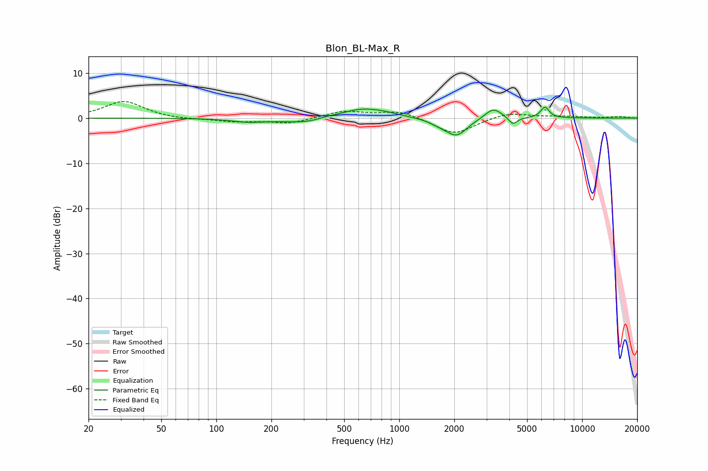

# Blon_BL-Max_R
See [usage instructions](https://github.com/jaakkopasanen/AutoEq#usage) for more options and info.

### Parametric EQs
Apply preamp of -2.5 dB when using parametric equalizer.

|   # | Type    |   Fc (Hz) |    Q |   Gain (dB) |
|-----|---------|-----------|------|-------------|
|   1 | Peaking |       150 | 1.58 |        -0.7 |
|   2 | Peaking |       315 | 1.08 |        -1.2 |
|   3 | Peaking |       399 | 2.52 |         0.4 |
|   4 | Peaking |       609 | 1.3  |         2   |
|   5 | Peaking |       830 | 1.64 |         0.7 |
|   6 | Peaking |      1667 | 2.71 |        -0.8 |
|   7 | Peaking |      2060 | 2.43 |        -3.8 |
|   8 | Peaking |      3270 | 3.05 |         2.5 |
|   9 | Peaking |      4184 | 6    |        -1.7 |
|  10 | Peaking |      6262 | 5.96 |         2.4 |

### Fixed Band EQs
When using fixed band (also called graphic) equalizer, apply preamp of **-3.8 dB** (if available) and set gains manually with these parameters.

|   # | Type    |   Fc (Hz) |    Q |   Gain (dB) |
|-----|---------|-----------|------|-------------|
|   1 | Peaking |        31 | 1.41 |         3.8 |
|   2 | Peaking |        62 | 1.41 |        -0.3 |
|   3 | Peaking |       125 | 1.41 |        -0.8 |
|   4 | Peaking |       250 | 1.41 |        -1.2 |
|   5 | Peaking |       500 | 1.41 |         1.5 |
|   6 | Peaking |      1000 | 1.41 |         1.6 |
|   7 | Peaking |      2000 | 1.41 |        -3.7 |
|   8 | Peaking |      4000 | 1.41 |         1.3 |
|   9 | Peaking |      8000 | 1.41 |         0.3 |
|  10 | Peaking |     16000 | 1.41 |         0.3 |

### Graphs

