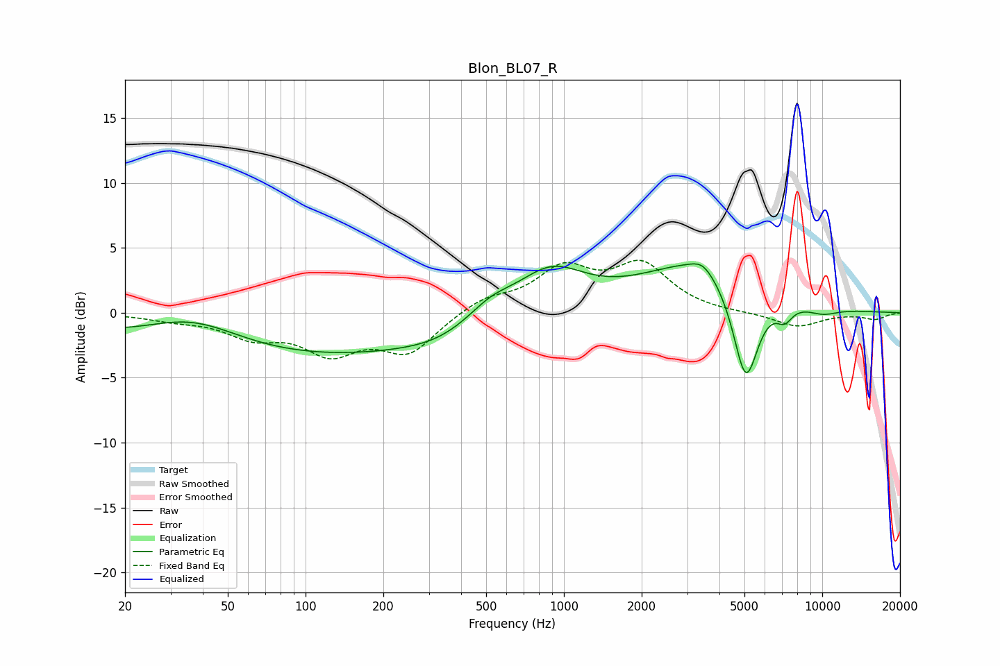

# Blon_BL07_R
See [usage instructions](https://github.com/jaakkopasanen/AutoEq#usage) for more options and info.

### Parametric EQs
Apply preamp of -3.9 dB when using parametric equalizer.

|   # | Type    |   Fc (Hz) |    Q |   Gain (dB) |
|-----|---------|-----------|------|-------------|
|   1 | Peaking |        36 | 0.74 |         2.5 |
|   2 | Peaking |        79 | 0.18 |        -3.6 |
|   3 | Peaking |       324 | 1.04 |        -0.5 |
|   4 | Peaking |       520 | 1.55 |         1.3 |
|   5 | Peaking |       886 | 1.06 |         3.3 |
|   6 | Peaking |      3444 | 3.31 |         0.7 |
|   7 | Peaking |      3491 | 0.61 |         4.1 |
|   8 | Peaking |      5055 | 2.7  |        -7.9 |
|   9 | Peaking |      7139 | 4.11 |        -1.2 |
|  10 | Peaking |     10000 | 1.85 |        -0.6 |

### Fixed Band EQs
When using fixed band (also called graphic) equalizer, apply preamp of **-4.1 dB** (if available) and set gains manually with these parameters.

|   # | Type    |   Fc (Hz) |    Q |   Gain (dB) |
|-----|---------|-----------|------|-------------|
|   1 | Peaking |        31 | 1.41 |        -0.4 |
|   2 | Peaking |        62 | 1.41 |        -1.6 |
|   3 | Peaking |       125 | 1.41 |        -2.8 |
|   4 | Peaking |       250 | 1.41 |        -2.9 |
|   5 | Peaking |       500 | 1.41 |         1.1 |
|   6 | Peaking |      1000 | 1.41 |         3.1 |
|   7 | Peaking |      2000 | 1.41 |         3.5 |
|   8 | Peaking |      4000 | 1.41 |        -0   |
|   9 | Peaking |      8000 | 1.41 |        -1.1 |
|  10 | Peaking |     16000 | 1.41 |        -0.5 |

### Graphs

