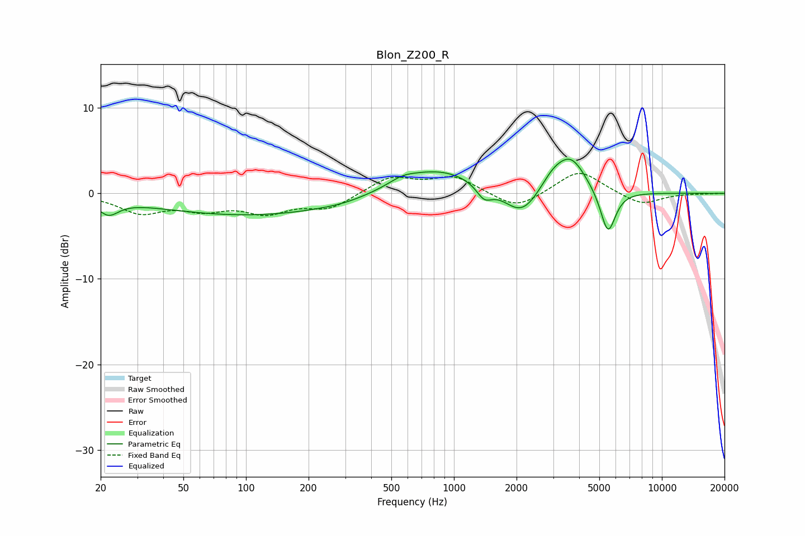

# Blon_Z200_R
See [usage instructions](https://github.com/jaakkopasanen/AutoEq#usage) for more options and info.

### Parametric EQs
Apply preamp of -4.1 dB when using parametric equalizer.

|   # | Type    |   Fc (Hz) |    Q |   Gain (dB) |
|-----|---------|-----------|------|-------------|
|   1 | Peaking |        22 | 2.92 |        -1.7 |
|   2 | Peaking |       108 | 0.3  |        -2.6 |
|   3 | Peaking |       293 | 1.44 |        -0.2 |
|   4 | Peaking |       565 | 2.21 |         0.7 |
|   5 | Peaking |       834 | 0.7  |         3   |
|   6 | Peaking |      1398 | 3.78 |        -1.6 |
|   7 | Peaking |      2117 | 1.65 |        -3.4 |
|   8 | Peaking |      2996 | 2.24 |         1.8 |
|   9 | Peaking |      3669 | 1.94 |         3.9 |
|  10 | Peaking |      5504 | 3.81 |        -5.2 |

### Fixed Band EQs
When using fixed band (also called graphic) equalizer, apply preamp of **-2.4 dB** (if available) and set gains manually with these parameters.

|   # | Type    |   Fc (Hz) |    Q |   Gain (dB) |
|-----|---------|-----------|------|-------------|
|   1 | Peaking |        31 | 1.41 |        -2.1 |
|   2 | Peaking |        62 | 1.41 |        -1.6 |
|   3 | Peaking |       125 | 1.41 |        -2   |
|   4 | Peaking |       250 | 1.41 |        -1.7 |
|   5 | Peaking |       500 | 1.41 |         1.9 |
|   6 | Peaking |      1000 | 1.41 |         1.9 |
|   7 | Peaking |      2000 | 1.41 |        -2   |
|   8 | Peaking |      4000 | 1.41 |         2.8 |
|   9 | Peaking |      8000 | 1.41 |        -1.4 |
|  10 | Peaking |     16000 | 1.41 |        -0   |

### Graphs

