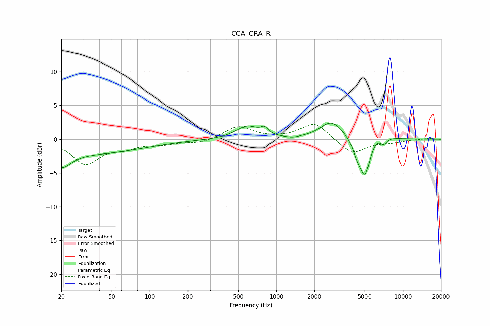

# CCA_CRA_R
See [usage instructions](https://github.com/jaakkopasanen/AutoEq#usage) for more options and info.

### Parametric EQs
Apply preamp of -2.5 dB when using parametric equalizer.

|   # | Type    |   Fc (Hz) |    Q |   Gain (dB) |
|-----|---------|-----------|------|-------------|
|   1 | Peaking |        20 | 1.84 |        -2.6 |
|   2 | Peaking |        37 | 0.37 |        -2   |
|   3 | Peaking |       589 | 1.6  |         1.9 |
|   4 | Peaking |       808 | 4.93 |         0.9 |
|   5 | Peaking |      1347 | 3.02 |        -0.2 |
|   6 | Peaking |      2729 | 1.6  |         2.6 |
|   7 | Peaking |      4342 | 4.19 |        -1.7 |
|   8 | Peaking |      5029 | 3.22 |        -5.9 |
|   9 | Peaking |      6017 | 1.52 |         1.3 |
|  10 | Peaking |      7014 | 5.1  |        -1.1 |

### Fixed Band EQs
When using fixed band (also called graphic) equalizer, apply preamp of **-2.3 dB** (if available) and set gains manually with these parameters.

|   # | Type    |   Fc (Hz) |    Q |   Gain (dB) |
|-----|---------|-----------|------|-------------|
|   1 | Peaking |        31 | 1.41 |        -3.6 |
|   2 | Peaking |        62 | 1.41 |        -1.1 |
|   3 | Peaking |       125 | 1.41 |        -0.6 |
|   4 | Peaking |       250 | 1.41 |        -0.6 |
|   5 | Peaking |       500 | 1.41 |         1.9 |
|   6 | Peaking |      1000 | 1.41 |         0   |
|   7 | Peaking |      2000 | 1.41 |         2.5 |
|   8 | Peaking |      4000 | 1.41 |        -2.2 |
|   9 | Peaking |      8000 | 1.41 |        -0.4 |
|  10 | Peaking |     16000 | 1.41 |         0.1 |

### Graphs

