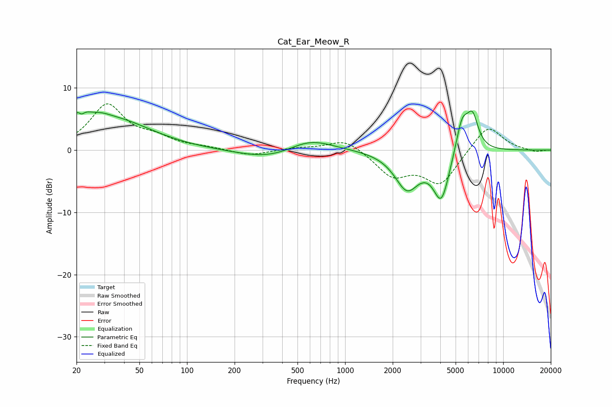

# Cat_Ear_Meow_R
See [usage instructions](https://github.com/jaakkopasanen/AutoEq#usage) for more options and info.

### Parametric EQs
Apply preamp of -6.4 dB when using parametric equalizer.

|   # | Type    |   Fc (Hz) |    Q |   Gain (dB) |
|-----|---------|-----------|------|-------------|
|   1 | Peaking |        21 | 3.41 |         4.6 |
|   2 | Peaking |        21 | 5.91 |        -2.4 |
|   3 | Peaking |        28 | 1.83 |         1.3 |
|   4 | Peaking |        36 | 0.6  |         4.5 |
|   5 | Peaking |       343 | 0.72 |        -1.7 |
|   6 | Peaking |       594 | 0.97 |         2.2 |
|   7 | Peaking |      2464 | 1.82 |        -5.9 |
|   8 | Peaking |      4065 | 2.68 |        -7.7 |
|   9 | Peaking |      5489 | 3.44 |         5.5 |
|  10 | Peaking |      6396 | 3.69 |         5.2 |

### Fixed Band EQs
When using fixed band (also called graphic) equalizer, apply preamp of **-7.5 dB** (if available) and set gains manually with these parameters.

|   # | Type    |   Fc (Hz) |    Q |   Gain (dB) |
|-----|---------|-----------|------|-------------|
|   1 | Peaking |        31 | 1.41 |         7.1 |
|   2 | Peaking |        62 | 1.41 |         1.6 |
|   3 | Peaking |       125 | 1.41 |         0.4 |
|   4 | Peaking |       250 | 1.41 |        -0.9 |
|   5 | Peaking |       500 | 1.41 |         0.3 |
|   6 | Peaking |      1000 | 1.41 |         1.9 |
|   7 | Peaking |      2000 | 1.41 |        -3.9 |
|   8 | Peaking |      4000 | 1.41 |        -5.3 |
|   9 | Peaking |      8000 | 1.41 |         4.2 |
|  10 | Peaking |     16000 | 1.41 |        -0.4 |

### Graphs

