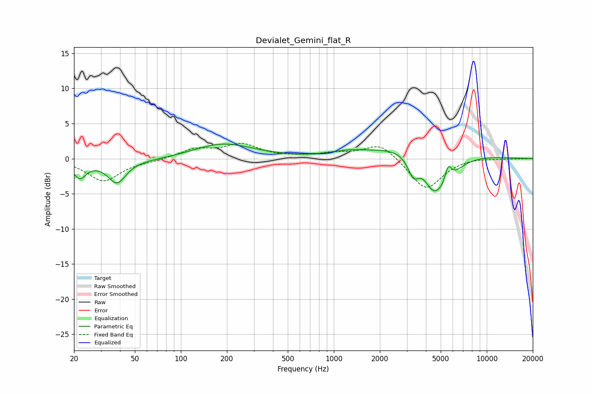

# Devialet_Gemini_flat_R
See [usage instructions](https://github.com/jaakkopasanen/AutoEq#usage) for more options and info.

### Parametric EQs
Apply preamp of -2.2 dB when using parametric equalizer.

|   # | Type    |   Fc (Hz) |    Q |   Gain (dB) |
|-----|---------|-----------|------|-------------|
|   1 | Peaking |        22 | 3.59 |        -2.2 |
|   2 | Peaking |        38 | 2.46 |        -3.1 |
|   3 | Peaking |        40 | 0.18 |        -0.4 |
|   4 | Peaking |       188 | 0.71 |         2.3 |
|   5 | Peaking |      1230 | 1.36 |         0.5 |
|   6 | Peaking |      3311 | 3.81 |        -2.8 |
|   7 | Peaking |      3821 | 0.51 |         2.7 |
|   8 | Peaking |      4389 | 2.79 |        -1.9 |
|   9 | Peaking |      5033 | 1.37 |        -5.9 |
|  10 | Peaking |      5592 | 5.97 |         2.5 |

### Fixed Band EQs
When using fixed band (also called graphic) equalizer, apply preamp of **-2.3 dB** (if available) and set gains manually with these parameters.

|   # | Type    |   Fc (Hz) |    Q |   Gain (dB) |
|-----|---------|-----------|------|-------------|
|   1 | Peaking |        31 | 1.41 |        -3.2 |
|   2 | Peaking |        62 | 1.41 |        -0.3 |
|   3 | Peaking |       125 | 1.41 |         1.3 |
|   4 | Peaking |       250 | 1.41 |         1.9 |
|   5 | Peaking |       500 | 1.41 |         0.1 |
|   6 | Peaking |      1000 | 1.41 |         0.7 |
|   7 | Peaking |      2000 | 1.41 |         2.3 |
|   8 | Peaking |      4000 | 1.41 |        -4.5 |
|   9 | Peaking |      8000 | 1.41 |         0.2 |
|  10 | Peaking |     16000 | 1.41 |        -0   |

### Graphs

