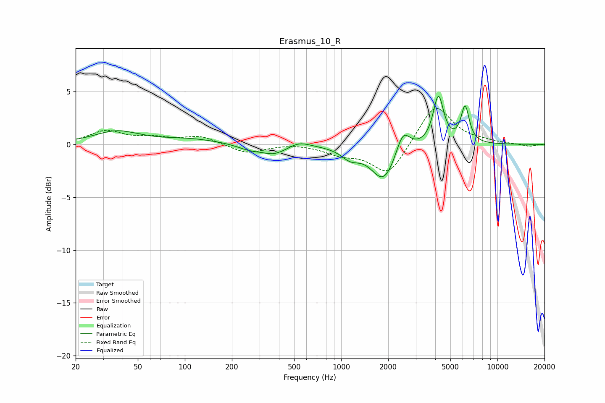

# Erasmus_10_R
See [usage instructions](https://github.com/jaakkopasanen/AutoEq#usage) for more options and info.

### Parametric EQs
Apply preamp of -4.7 dB when using parametric equalizer.

|   # | Type    |   Fc (Hz) |    Q |   Gain (dB) |
|-----|---------|-----------|------|-------------|
|   1 | Peaking |        37 | 1    |         1.2 |
|   2 | Peaking |       108 | 0.74 |         0.5 |
|   3 | Peaking |       257 | 1.86 |        -0.4 |
|   4 | Peaking |       373 | 1.66 |        -0.9 |
|   5 | Peaking |       537 | 2.1  |         0.5 |
|   6 | Peaking |      1145 | 2.43 |        -1   |
|   7 | Peaking |      1872 | 1.8  |        -3.4 |
|   8 | Peaking |      2485 | 3.26 |         2.2 |
|   9 | Peaking |      4191 | 4.24 |         4.6 |
|  10 | Peaking |      6211 | 5.23 |         3.4 |

### Fixed Band EQs
When using fixed band (also called graphic) equalizer, apply preamp of **-3.5 dB** (if available) and set gains manually with these parameters.

|   # | Type    |   Fc (Hz) |    Q |   Gain (dB) |
|-----|---------|-----------|------|-------------|
|   1 | Peaking |        31 | 1.41 |         1.2 |
|   2 | Peaking |        62 | 1.41 |         0.5 |
|   3 | Peaking |       125 | 1.41 |         0.8 |
|   4 | Peaking |       250 | 1.41 |        -0.9 |
|   5 | Peaking |       500 | 1.41 |         0.1 |
|   6 | Peaking |      1000 | 1.41 |        -0.8 |
|   7 | Peaking |      2000 | 1.41 |        -3   |
|   8 | Peaking |      4000 | 1.41 |         3.9 |
|   9 | Peaking |      8000 | 1.41 |         0.2 |
|  10 | Peaking |     16000 | 1.41 |        -0.2 |

### Graphs

