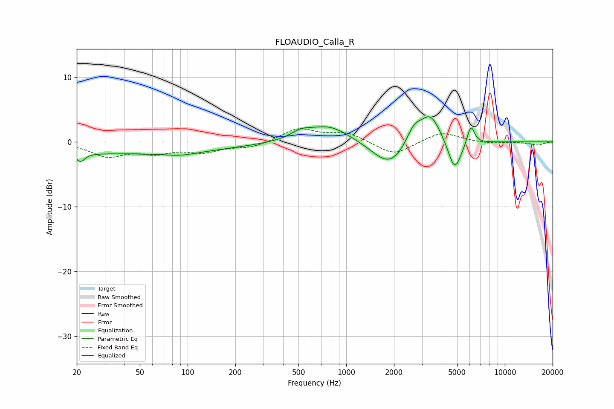

# FLOAUDIO_Calla_R
See [usage instructions](https://github.com/jaakkopasanen/AutoEq#usage) for more options and info.

### Parametric EQs
Apply preamp of -4.0 dB when using parametric equalizer.

|   # | Type    |   Fc (Hz) |    Q |   Gain (dB) |
|-----|---------|-----------|------|-------------|
|   1 | Peaking |        21 | 5.44 |        -1.3 |
|   2 | Peaking |        38 | 0.18 |        -1.8 |
|   3 | Peaking |        90 | 1.43 |        -0.5 |
|   4 | Peaking |       518 | 2.26 |         1   |
|   5 | Peaking |       778 | 1.07 |         2.6 |
|   6 | Peaking |      1879 | 1.32 |        -4   |
|   7 | Peaking |      2670 | 2.95 |         2.6 |
|   8 | Peaking |      3395 | 2.15 |         4.5 |
|   9 | Peaking |      4828 | 3.33 |        -4.9 |
|  10 | Peaking |      6102 | 5.99 |         3   |

### Fixed Band EQs
When using fixed band (also called graphic) equalizer, apply preamp of **-2.1 dB** (if available) and set gains manually with these parameters.

|   # | Type    |   Fc (Hz) |    Q |   Gain (dB) |
|-----|---------|-----------|------|-------------|
|   1 | Peaking |        31 | 1.41 |        -2.1 |
|   2 | Peaking |        62 | 1.41 |        -1.4 |
|   3 | Peaking |       125 | 1.41 |        -1.4 |
|   4 | Peaking |       250 | 1.41 |        -0.8 |
|   5 | Peaking |       500 | 1.41 |         2   |
|   6 | Peaking |      1000 | 1.41 |         1.4 |
|   7 | Peaking |      2000 | 1.41 |        -2.1 |
|   8 | Peaking |      4000 | 1.41 |         1.6 |
|   9 | Peaking |      8000 | 1.41 |        -0.3 |
|  10 | Peaking |     16000 | 1.41 |        -0.5 |

### Graphs

