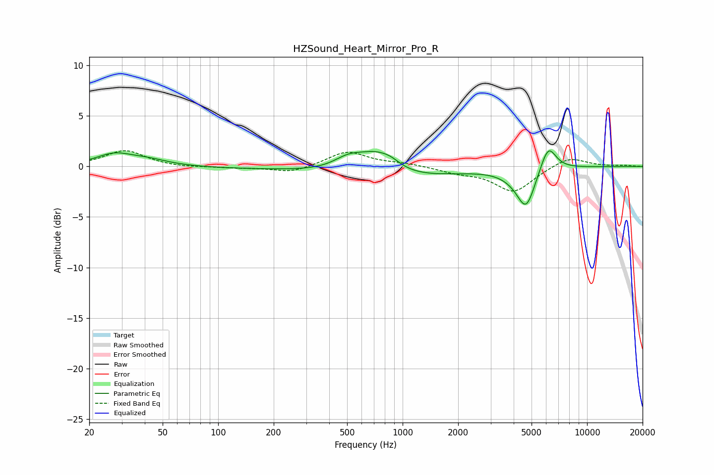

# HZSound_Heart_Mirror_Pro_R
See [usage instructions](https://github.com/jaakkopasanen/AutoEq#usage) for more options and info.

### Parametric EQs
Apply preamp of -1.6 dB when using parametric equalizer.

|   # | Type    |   Fc (Hz) |    Q |   Gain (dB) |
|-----|---------|-----------|------|-------------|
|   1 | Peaking |        27 | 1.48 |         1.1 |
|   2 | Peaking |        41 | 1.23 |         0.6 |
|   3 | Peaking |       341 | 0.18 |        -0.2 |
|   4 | Peaking |       510 | 1.68 |         1.3 |
|   5 | Peaking |       713 | 1.48 |         1.8 |
|   6 | Peaking |       860 | 2.56 |         0.6 |
|   7 | Peaking |       936 | 0.46 |        -1   |
|   8 | Peaking |      4090 | 1.75 |        -0.6 |
|   9 | Peaking |      4678 | 2.89 |        -3.6 |
|  10 | Peaking |      6158 | 3.23 |         2.6 |

### Fixed Band EQs
When using fixed band (also called graphic) equalizer, apply preamp of **-1.6 dB** (if available) and set gains manually with these parameters.

|   # | Type    |   Fc (Hz) |    Q |   Gain (dB) |
|-----|---------|-----------|------|-------------|
|   1 | Peaking |        31 | 1.41 |         1.6 |
|   2 | Peaking |        62 | 1.41 |        -0.1 |
|   3 | Peaking |       125 | 1.41 |        -0.1 |
|   4 | Peaking |       250 | 1.41 |        -0.6 |
|   5 | Peaking |       500 | 1.41 |         1.5 |
|   6 | Peaking |      1000 | 1.41 |         0.3 |
|   7 | Peaking |      2000 | 1.41 |        -0.5 |
|   8 | Peaking |      4000 | 1.41 |        -2.5 |
|   9 | Peaking |      8000 | 1.41 |         1   |
|  10 | Peaking |     16000 | 1.41 |         0.1 |

### Graphs

