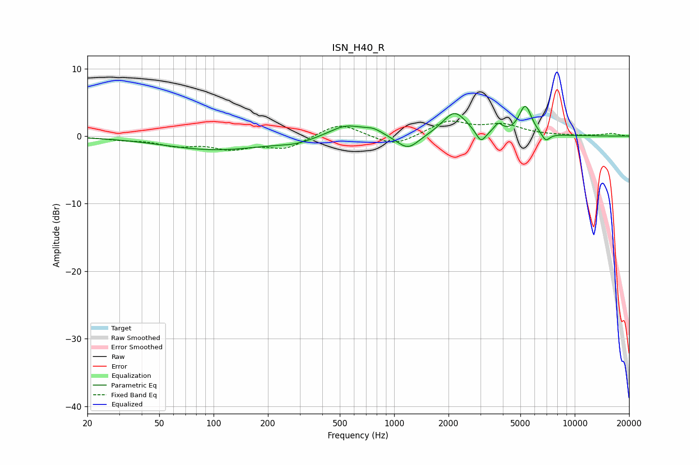

# ISN_H40_R
See [usage instructions](https://github.com/jaakkopasanen/AutoEq#usage) for more options and info.

### Parametric EQs
Apply preamp of -4.5 dB when using parametric equalizer.

|   # | Type    |   Fc (Hz) |    Q |   Gain (dB) |
|-----|---------|-----------|------|-------------|
|   1 | Peaking |       103 | 0.49 |        -2   |
|   2 | Peaking |       285 | 1.47 |        -0.6 |
|   3 | Peaking |       542 | 1.51 |         1.8 |
|   4 | Peaking |       769 | 2.79 |         0.8 |
|   5 | Peaking |      1193 | 2.29 |        -2.2 |
|   6 | Peaking |      2159 | 2.13 |         3.6 |
|   7 | Peaking |      3024 | 5.2  |        -1.9 |
|   8 | Peaking |      3770 | 6    |         1.3 |
|   9 | Peaking |      5324 | 4.03 |         4.3 |
|  10 | Peaking |      6908 | 5.98 |        -1.2 |

### Fixed Band EQs
When using fixed band (also called graphic) equalizer, apply preamp of **-2.3 dB** (if available) and set gains manually with these parameters.

|   # | Type    |   Fc (Hz) |    Q |   Gain (dB) |
|-----|---------|-----------|------|-------------|
|   1 | Peaking |        31 | 1.41 |        -0.4 |
|   2 | Peaking |        62 | 1.41 |        -1.2 |
|   3 | Peaking |       125 | 1.41 |        -1.6 |
|   4 | Peaking |       250 | 1.41 |        -1.8 |
|   5 | Peaking |       500 | 1.41 |         2   |
|   6 | Peaking |      1000 | 1.41 |        -1.6 |
|   7 | Peaking |      2000 | 1.41 |         2.2 |
|   8 | Peaking |      4000 | 1.41 |         1.5 |
|   9 | Peaking |      8000 | 1.41 |         0   |
|  10 | Peaking |     16000 | 1.41 |         0.4 |

### Graphs

