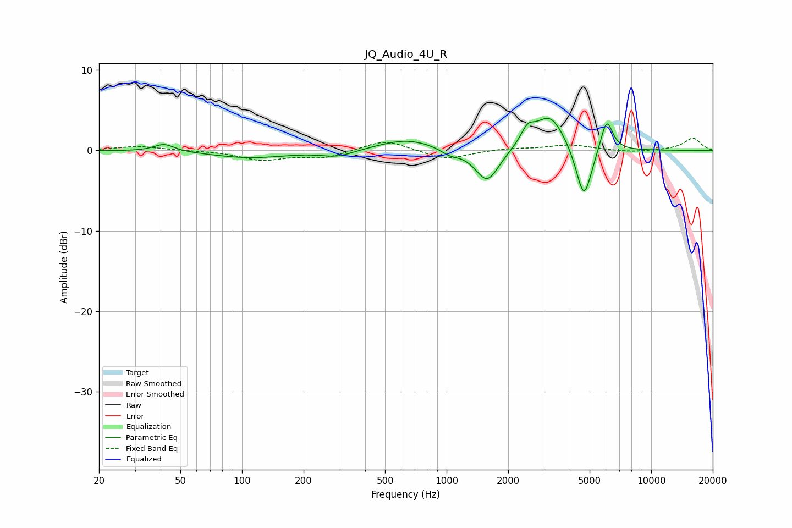

# JQ_Audio_4U_R
See [usage instructions](https://github.com/jaakkopasanen/AutoEq#usage) for more options and info.

### Parametric EQs
Apply preamp of -4.1 dB when using parametric equalizer.

|   # | Type    |   Fc (Hz) |    Q |   Gain (dB) |
|-----|---------|-----------|------|-------------|
|   1 | Peaking |        42 | 2.92 |         0.9 |
|   2 | Peaking |       109 | 0.77 |        -0.9 |
|   3 | Peaking |       293 | 1.78 |        -0.8 |
|   4 | Peaking |       640 | 1.04 |         1.4 |
|   5 | Peaking |      1037 | 3.16 |        -0.7 |
|   6 | Peaking |      1579 | 2.41 |        -4.2 |
|   7 | Peaking |      2486 | 4.21 |         1.9 |
|   8 | Peaking |      3201 | 1.91 |         4.5 |
|   9 | Peaking |      4690 | 3.6  |        -6.9 |
|  10 | Peaking |      6057 | 4.58 |         4.2 |

### Fixed Band EQs
When using fixed band (also called graphic) equalizer, apply preamp of **-1.6 dB** (if available) and set gains manually with these parameters.

|   # | Type    |   Fc (Hz) |    Q |   Gain (dB) |
|-----|---------|-----------|------|-------------|
|   1 | Peaking |        31 | 1.41 |         0.5 |
|   2 | Peaking |        62 | 1.41 |        -0   |
|   3 | Peaking |       125 | 1.41 |        -1.1 |
|   4 | Peaking |       250 | 1.41 |        -0.9 |
|   5 | Peaking |       500 | 1.41 |         1.4 |
|   6 | Peaking |      1000 | 1.41 |        -1.2 |
|   7 | Peaking |      2000 | 1.41 |         0.3 |
|   8 | Peaking |      4000 | 1.41 |         0.7 |
|   9 | Peaking |      8000 | 1.41 |        -0.3 |
|  10 | Peaking |     16000 | 1.41 |         1.5 |

### Graphs

