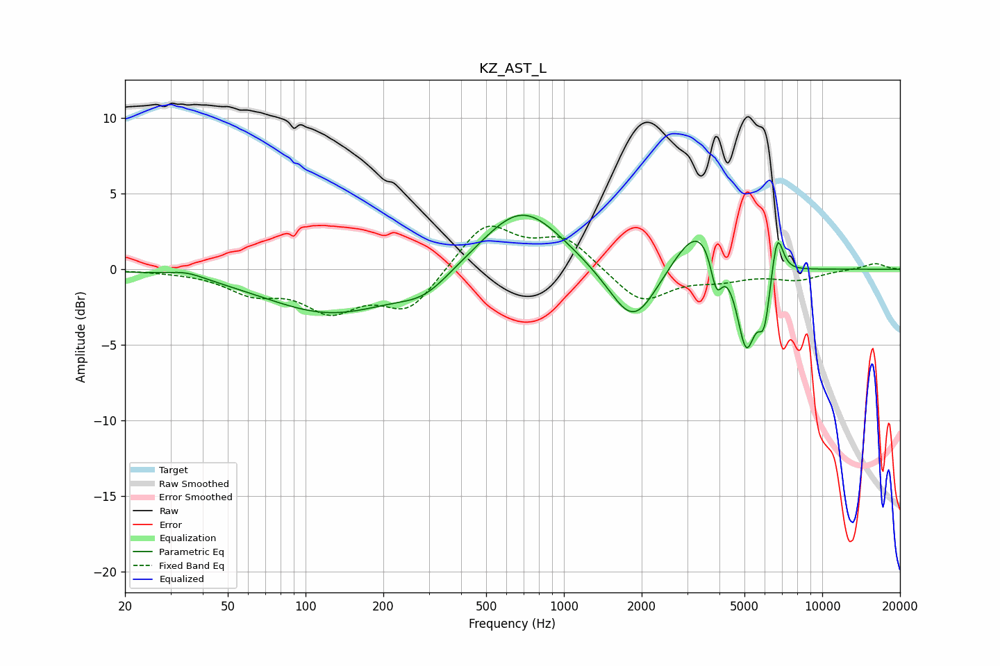

# KZ_AST_L
See [usage instructions](https://github.com/jaakkopasanen/AutoEq#usage) for more options and info.

### Parametric EQs
Apply preamp of -3.7 dB when using parametric equalizer.

|   # | Type    |   Fc (Hz) |    Q |   Gain (dB) |
|-----|---------|-----------|------|-------------|
|   1 | Peaking |        35 | 1.96 |         0.4 |
|   2 | Peaking |       127 | 0.54 |        -2.9 |
|   3 | Peaking |       288 | 1.42 |        -1.2 |
|   4 | Peaking |       687 | 0.91 |         4.3 |
|   5 | Peaking |      1858 | 1.48 |        -4.2 |
|   6 | Peaking |      3372 | 1.43 |         3.6 |
|   7 | Peaking |      3895 | 6    |        -2.7 |
|   8 | Peaking |      5074 | 3.72 |        -5.7 |
|   9 | Peaking |      5964 | 5.93 |        -3.2 |
|  10 | Peaking |      6695 | 5.99 |         3.1 |

### Fixed Band EQs
When using fixed band (also called graphic) equalizer, apply preamp of **-3.0 dB** (if available) and set gains manually with these parameters.

|   # | Type    |   Fc (Hz) |    Q |   Gain (dB) |
|-----|---------|-----------|------|-------------|
|   1 | Peaking |        31 | 1.41 |        -0.1 |
|   2 | Peaking |        62 | 1.41 |        -1.4 |
|   3 | Peaking |       125 | 1.41 |        -2.4 |
|   4 | Peaking |       250 | 1.41 |        -2.6 |
|   5 | Peaking |       500 | 1.41 |         3.1 |
|   6 | Peaking |      1000 | 1.41 |         2   |
|   7 | Peaking |      2000 | 1.41 |        -2.3 |
|   8 | Peaking |      4000 | 1.41 |        -0.6 |
|   9 | Peaking |      8000 | 1.41 |        -0.6 |
|  10 | Peaking |     16000 | 1.41 |         0.4 |

### Graphs

