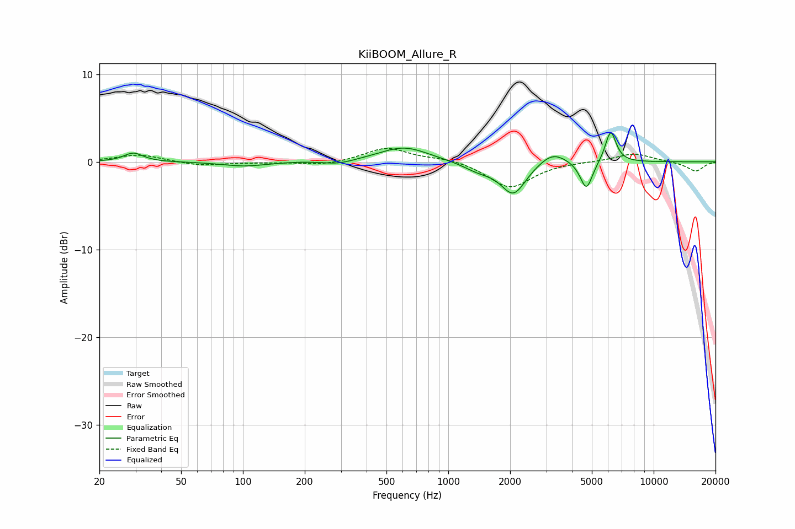

# KiiBOOM_Allure_R
See [usage instructions](https://github.com/jaakkopasanen/AutoEq#usage) for more options and info.

### Parametric EQs
Apply preamp of -3.4 dB when using parametric equalizer.

|   # | Type    |   Fc (Hz) |    Q |   Gain (dB) |
|-----|---------|-----------|------|-------------|
|   1 | Peaking |        29 | 3.08 |         1   |
|   2 | Peaking |       101 | 1.33 |        -0.5 |
|   3 | Peaking |       190 | 2.14 |         0   |
|   4 | Peaking |       292 | 1.91 |        -0.4 |
|   5 | Peaking |       609 | 1.17 |         1.7 |
|   6 | Peaking |      1406 | 1.83 |        -0.9 |
|   7 | Peaking |      2076 | 2.33 |        -3.6 |
|   8 | Peaking |      3222 | 2.14 |         1.4 |
|   9 | Peaking |      4701 | 4.63 |        -3.3 |
|  10 | Peaking |      6175 | 5.21 |         3.6 |

### Fixed Band EQs
When using fixed band (also called graphic) equalizer, apply preamp of **-1.6 dB** (if available) and set gains manually with these parameters.

|   # | Type    |   Fc (Hz) |    Q |   Gain (dB) |
|-----|---------|-----------|------|-------------|
|   1 | Peaking |        31 | 1.41 |         0.8 |
|   2 | Peaking |        62 | 1.41 |        -0.5 |
|   3 | Peaking |       125 | 1.41 |        -0.1 |
|   4 | Peaking |       250 | 1.41 |        -0.4 |
|   5 | Peaking |       500 | 1.41 |         1.6 |
|   6 | Peaking |      1000 | 1.41 |         0.4 |
|   7 | Peaking |      2000 | 1.41 |        -3   |
|   8 | Peaking |      4000 | 1.41 |         0   |
|   9 | Peaking |      8000 | 1.41 |         1   |
|  10 | Peaking |     16000 | 1.41 |        -1.1 |

### Graphs

