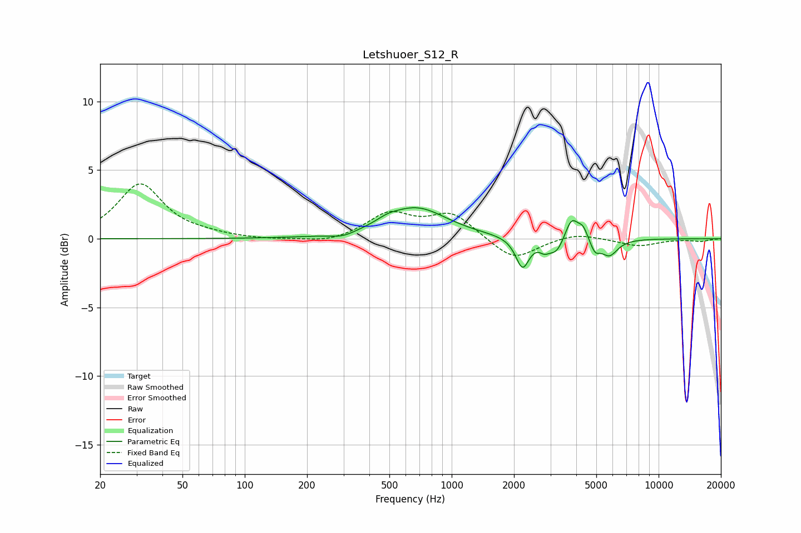

# Letshuoer_S12_R
See [usage instructions](https://github.com/jaakkopasanen/AutoEq#usage) for more options and info.

### Parametric EQs
Apply preamp of -2.4 dB when using parametric equalizer.

|   # | Type    |   Fc (Hz) |    Q |   Gain (dB) |
|-----|---------|-----------|------|-------------|
|   1 | Peaking |       298 | 2.31 |        -0.3 |
|   2 | Peaking |       489 | 2.94 |         0.3 |
|   3 | Peaking |       671 | 0.95 |         2.2 |
|   4 | Peaking |      2199 | 4.4  |        -2.2 |
|   5 | Peaking |      2806 | 6    |        -0.5 |
|   6 | Peaking |      3210 | 3.65 |        -1.1 |
|   7 | Peaking |      3794 | 4.33 |         1.7 |
|   8 | Peaking |      4313 | 6    |         0.8 |
|   9 | Peaking |      4925 | 6    |        -0.9 |
|  10 | Peaking |      5779 | 3.43 |        -1.2 |

### Fixed Band EQs
When using fixed band (also called graphic) equalizer, apply preamp of **-4.1 dB** (if available) and set gains manually with these parameters.

|   # | Type    |   Fc (Hz) |    Q |   Gain (dB) |
|-----|---------|-----------|------|-------------|
|   1 | Peaking |        31 | 1.41 |         4   |
|   2 | Peaking |        62 | 1.41 |         0.2 |
|   3 | Peaking |       125 | 1.41 |        -0.1 |
|   4 | Peaking |       250 | 1.41 |        -0.4 |
|   5 | Peaking |       500 | 1.41 |         1.8 |
|   6 | Peaking |      1000 | 1.41 |         1.8 |
|   7 | Peaking |      2000 | 1.41 |        -1.6 |
|   8 | Peaking |      4000 | 1.41 |         0.4 |
|   9 | Peaking |      8000 | 1.41 |        -0.5 |
|  10 | Peaking |     16000 | 1.41 |        -0.2 |

### Graphs

