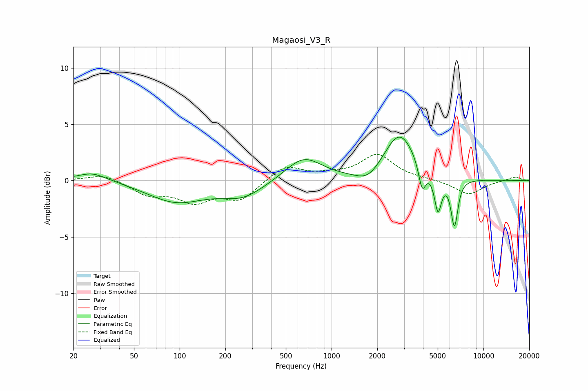

# Magaosi_V3_R
See [usage instructions](https://github.com/jaakkopasanen/AutoEq#usage) for more options and info.

### Parametric EQs
Apply preamp of -4.0 dB when using parametric equalizer.

|   # | Type    |   Fc (Hz) |    Q |   Gain (dB) |
|-----|---------|-----------|------|-------------|
|   1 | Peaking |        27 | 2.01 |         0.3 |
|   2 | Peaking |        27 | 1.11 |         0.6 |
|   3 | Peaking |        95 | 0.75 |        -1.8 |
|   4 | Peaking |       261 | 0.99 |        -1.4 |
|   5 | Peaking |       655 | 1.17 |         2.1 |
|   6 | Peaking |      1743 | 1.77 |        -1   |
|   7 | Peaking |      2804 | 1.38 |         4.2 |
|   8 | Peaking |      3948 | 5.94 |        -2.3 |
|   9 | Peaking |      5017 | 6    |        -3.2 |
|  10 | Peaking |      6440 | 6    |        -4.2 |

### Fixed Band EQs
When using fixed band (also called graphic) equalizer, apply preamp of **-2.4 dB** (if available) and set gains manually with these parameters.

|   # | Type    |   Fc (Hz) |    Q |   Gain (dB) |
|-----|---------|-----------|------|-------------|
|   1 | Peaking |        31 | 1.41 |         0.6 |
|   2 | Peaking |        62 | 1.41 |        -1.2 |
|   3 | Peaking |       125 | 1.41 |        -1.7 |
|   4 | Peaking |       250 | 1.41 |        -1.6 |
|   5 | Peaking |       500 | 1.41 |         1.4 |
|   6 | Peaking |      1000 | 1.41 |         0.4 |
|   7 | Peaking |      2000 | 1.41 |         2.2 |
|   8 | Peaking |      4000 | 1.41 |         0.1 |
|   9 | Peaking |      8000 | 1.41 |        -1.2 |
|  10 | Peaking |     16000 | 1.41 |         0.4 |

### Graphs

