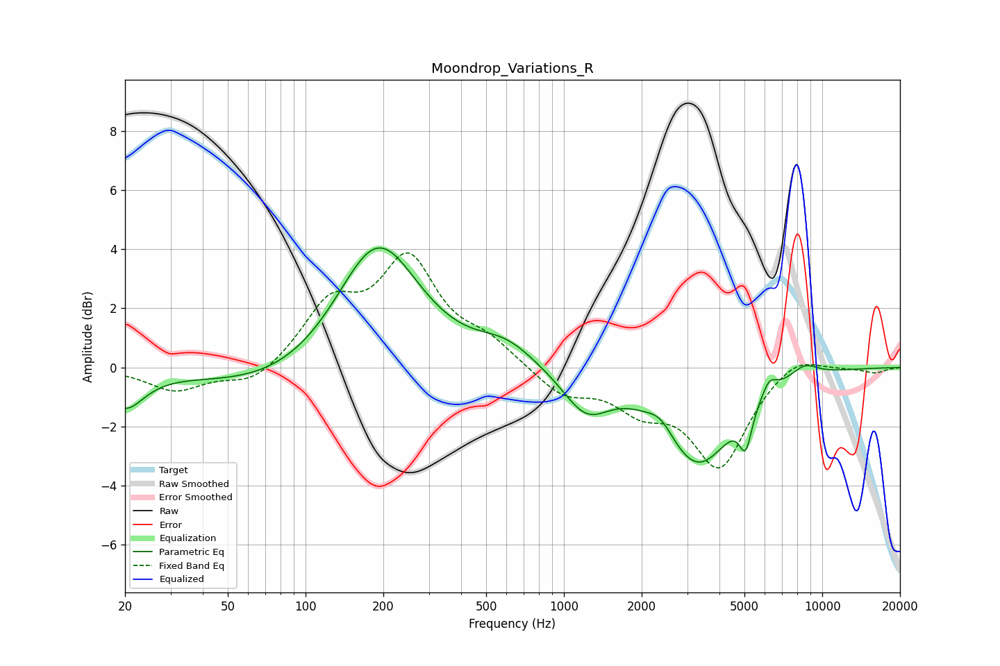

# Moondrop_Variations_R
See [usage instructions](https://github.com/jaakkopasanen/AutoEq#usage) for more options and info.

### Parametric EQs
Apply preamp of -4.1 dB when using parametric equalizer.

|   # | Type    |   Fc (Hz) |    Q |   Gain (dB) |
|-----|---------|-----------|------|-------------|
|   1 | Peaking |        20 | 1.94 |        -1.3 |
|   2 | Peaking |        79 | 0.48 |        -0.8 |
|   3 | Peaking |       190 | 0.91 |         4.4 |
|   4 | Peaking |       596 | 1.27 |         0.7 |
|   5 | Peaking |      1219 | 1.56 |        -1.4 |
|   6 | Peaking |      2372 | 2.9  |         0.5 |
|   7 | Peaking |      3293 | 1.06 |        -3.2 |
|   8 | Peaking |      5054 | 5.79 |        -1.3 |
|   9 | Peaking |      6228 | 4.91 |         0.5 |
|  10 | Peaking |      8536 | 2.46 |         0.4 |

### Fixed Band EQs
When using fixed band (also called graphic) equalizer, apply preamp of **-4.0 dB** (if available) and set gains manually with these parameters.

|   # | Type    |   Fc (Hz) |    Q |   Gain (dB) |
|-----|---------|-----------|------|-------------|
|   1 | Peaking |        31 | 1.41 |        -0.8 |
|   2 | Peaking |        62 | 1.41 |        -0.6 |
|   3 | Peaking |       125 | 1.41 |         2   |
|   4 | Peaking |       250 | 1.41 |         3.4 |
|   5 | Peaking |       500 | 1.41 |         0.8 |
|   6 | Peaking |      1000 | 1.41 |        -0.9 |
|   7 | Peaking |      2000 | 1.41 |        -1.2 |
|   8 | Peaking |      4000 | 1.41 |        -3.3 |
|   9 | Peaking |      8000 | 1.41 |         0.5 |
|  10 | Peaking |     16000 | 1.41 |        -0.2 |

### Graphs

