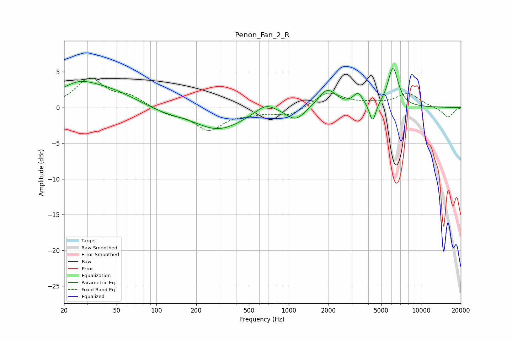

# Penon_Fan_2_R
See [usage instructions](https://github.com/jaakkopasanen/AutoEq#usage) for more options and info.

### Parametric EQs
Apply preamp of -5.6 dB when using parametric equalizer.

|   # | Type    |   Fc (Hz) |    Q |   Gain (dB) |
|-----|---------|-----------|------|-------------|
|   1 | Peaking |        26 | 0.93 |         2.8 |
|   2 | Peaking |        47 | 0.76 |         1.7 |
|   3 | Peaking |       116 | 1.13 |        -0.5 |
|   4 | Peaking |       294 | 0.76 |        -3   |
|   5 | Peaking |       671 | 1.85 |         1.4 |
|   6 | Peaking |      1131 | 2.01 |        -1.8 |
|   7 | Peaking |      1957 | 2.12 |         2.6 |
|   8 | Peaking |      3346 | 4.01 |         1.7 |
|   9 | Peaking |      4312 | 5.83 |        -2.7 |
|  10 | Peaking |      6145 | 3.53 |         5.5 |

### Fixed Band EQs
When using fixed band (also called graphic) equalizer, apply preamp of **-4.2 dB** (if available) and set gains manually with these parameters.

|   # | Type    |   Fc (Hz) |    Q |   Gain (dB) |
|-----|---------|-----------|------|-------------|
|   1 | Peaking |        31 | 1.41 |         3.9 |
|   2 | Peaking |        62 | 1.41 |         1.4 |
|   3 | Peaking |       125 | 1.41 |        -0.8 |
|   4 | Peaking |       250 | 1.41 |        -3   |
|   5 | Peaking |       500 | 1.41 |        -0.6 |
|   6 | Peaking |      1000 | 1.41 |        -1.2 |
|   7 | Peaking |      2000 | 1.41 |         2.1 |
|   8 | Peaking |      4000 | 1.41 |         0.4 |
|   9 | Peaking |      8000 | 1.41 |         1.9 |
|  10 | Peaking |     16000 | 1.41 |        -1.4 |

### Graphs

