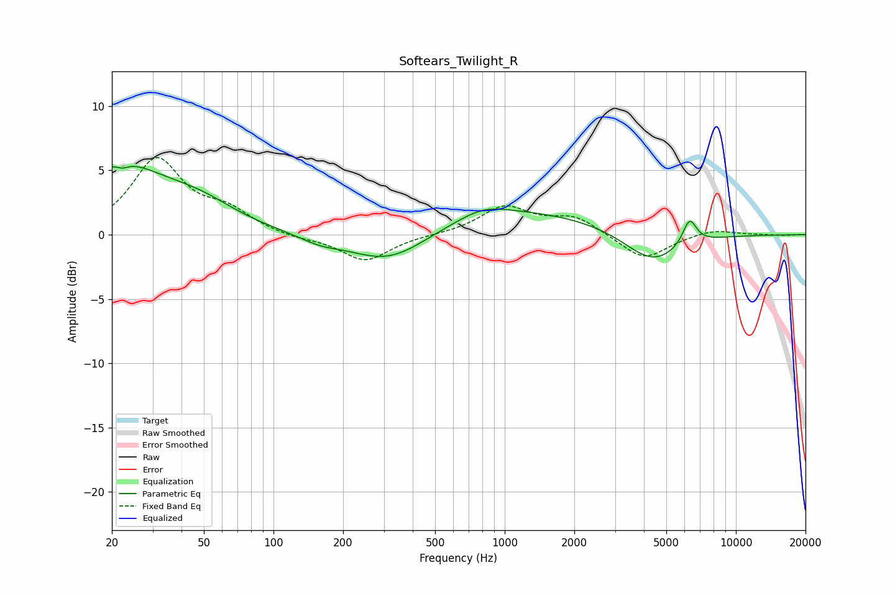

# Softears_Twilight_R
See [usage instructions](https://github.com/jaakkopasanen/AutoEq#usage) for more options and info.

### Parametric EQs
Apply preamp of -5.4 dB when using parametric equalizer.

|   # | Type    |   Fc (Hz) |    Q |   Gain (dB) |
|-----|---------|-----------|------|-------------|
|   1 | Peaking |        21 | 0.68 |         5.2 |
|   2 | Peaking |        22 | 6    |         3.1 |
|   3 | Peaking |        22 | 5.81 |        -3.5 |
|   4 | Peaking |        48 | 0.89 |         1.6 |
|   5 | Peaking |       158 | 1.61 |        -0.5 |
|   6 | Peaking |       315 | 0.83 |        -2.5 |
|   7 | Peaking |       807 | 1.36 |         0.8 |
|   8 | Peaking |      1137 | 0.36 |         1.9 |
|   9 | Peaking |      4369 | 1.13 |        -2.5 |
|  10 | Peaking |      6306 | 4.56 |         2   |

### Fixed Band EQs
When using fixed band (also called graphic) equalizer, apply preamp of **-6.1 dB** (if available) and set gains manually with these parameters.

|   # | Type    |   Fc (Hz) |    Q |   Gain (dB) |
|-----|---------|-----------|------|-------------|
|   1 | Peaking |        31 | 1.41 |         5.7 |
|   2 | Peaking |        62 | 1.41 |         1.6 |
|   3 | Peaking |       125 | 1.41 |        -0.3 |
|   4 | Peaking |       250 | 1.41 |        -2.1 |
|   5 | Peaking |       500 | 1.41 |        -0   |
|   6 | Peaking |      1000 | 1.41 |         2.1 |
|   7 | Peaking |      2000 | 1.41 |         1.3 |
|   8 | Peaking |      4000 | 1.41 |        -2   |
|   9 | Peaking |      8000 | 1.41 |         0.5 |
|  10 | Peaking |     16000 | 1.41 |        -0.1 |

### Graphs

