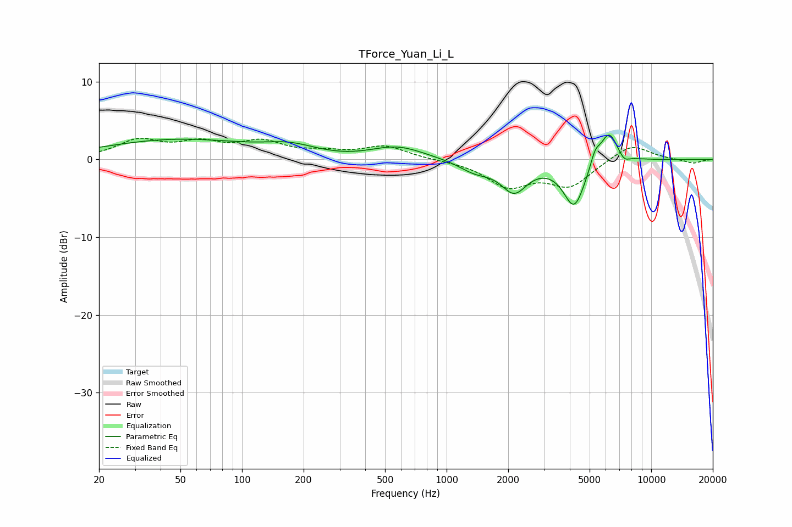

# TForce_Yuan_Li_L
See [usage instructions](https://github.com/jaakkopasanen/AutoEq#usage) for more options and info.

### Parametric EQs
Apply preamp of -3.2 dB when using parametric equalizer.

|   # | Type    |   Fc (Hz) |    Q |   Gain (dB) |
|-----|---------|-----------|------|-------------|
|   1 | Peaking |        48 | 0.39 |         2.5 |
|   2 | Peaking |       171 | 1.12 |         1.2 |
|   3 | Peaking |       324 | 1.24 |        -0.2 |
|   4 | Peaking |       576 | 1.09 |         1.6 |
|   5 | Peaking |      1377 | 1.75 |        -1.4 |
|   6 | Peaking |      2139 | 2.18 |        -3.8 |
|   7 | Peaking |      4207 | 2.6  |        -6   |
|   8 | Peaking |      5319 | 6    |         1.7 |
|   9 | Peaking |      6208 | 3.15 |         4.1 |
|  10 | Peaking |      7365 | 5.27 |        -0.9 |

### Fixed Band EQs
When using fixed band (also called graphic) equalizer, apply preamp of **-2.8 dB** (if available) and set gains manually with these parameters.

|   # | Type    |   Fc (Hz) |    Q |   Gain (dB) |
|-----|---------|-----------|------|-------------|
|   1 | Peaking |        31 | 1.41 |         2.3 |
|   2 | Peaking |        62 | 1.41 |         1.8 |
|   3 | Peaking |       125 | 1.41 |         2   |
|   4 | Peaking |       250 | 1.41 |         0.7 |
|   5 | Peaking |       500 | 1.41 |         1.7 |
|   6 | Peaking |      1000 | 1.41 |        -0   |
|   7 | Peaking |      2000 | 1.41 |        -3.3 |
|   8 | Peaking |      4000 | 1.41 |        -3.3 |
|   9 | Peaking |      8000 | 1.41 |         2.1 |
|  10 | Peaking |     16000 | 1.41 |        -0.5 |

### Graphs

