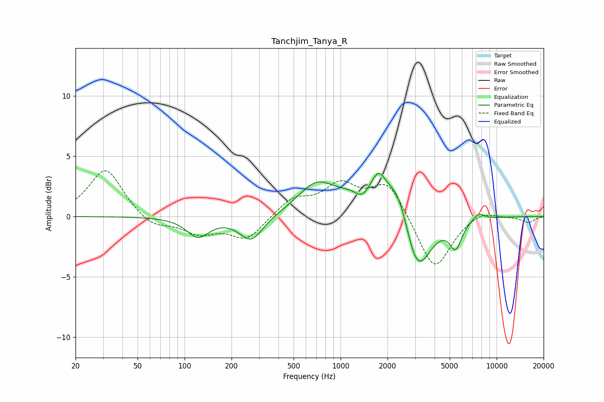

# Tanchjim_Tanya_R
See [usage instructions](https://github.com/jaakkopasanen/AutoEq#usage) for more options and info.

### Parametric EQs
Apply preamp of -3.7 dB when using parametric equalizer.

|   # | Type    |   Fc (Hz) |    Q |   Gain (dB) |
|-----|---------|-----------|------|-------------|
|   1 | Peaking |       122 | 1.99 |        -1.6 |
|   2 | Peaking |       268 | 1.86 |        -2.1 |
|   3 | Peaking |       699 | 1.21 |         2.4 |
|   4 | Peaking |      1381 | 3.01 |        -1.3 |
|   5 | Peaking |      1718 | 0.95 |         3.4 |
|   6 | Peaking |      1756 | 4.5  |         0.9 |
|   7 | Peaking |      2410 | 2.12 |         2.2 |
|   8 | Peaking |      3072 | 1.58 |        -5.9 |
|   9 | Peaking |      5465 | 3.58 |        -2.2 |
|  10 | Peaking |      7665 | 3.67 |         0.6 |

### Fixed Band EQs
When using fixed band (also called graphic) equalizer, apply preamp of **-3.9 dB** (if available) and set gains manually with these parameters.

|   # | Type    |   Fc (Hz) |    Q |   Gain (dB) |
|-----|---------|-----------|------|-------------|
|   1 | Peaking |        31 | 1.41 |         4   |
|   2 | Peaking |        62 | 1.41 |        -1   |
|   3 | Peaking |       125 | 1.41 |        -1.3 |
|   4 | Peaking |       250 | 1.41 |        -1.9 |
|   5 | Peaking |       500 | 1.41 |         1.4 |
|   6 | Peaking |      1000 | 1.41 |         2.4 |
|   7 | Peaking |      2000 | 1.41 |         2.9 |
|   8 | Peaking |      4000 | 1.41 |        -4.6 |
|   9 | Peaking |      8000 | 1.41 |         0.6 |
|  10 | Peaking |     16000 | 1.41 |        -0.5 |

### Graphs

