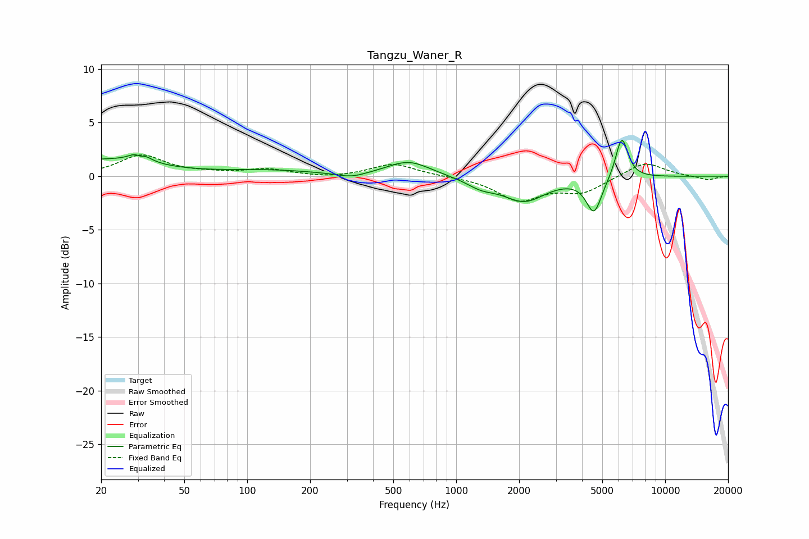

# Tangzu_Waner_R
See [usage instructions](https://github.com/jaakkopasanen/AutoEq#usage) for more options and info.

### Parametric EQs
Apply preamp of -3.4 dB when using parametric equalizer.

|   # | Type    |   Fc (Hz) |    Q |   Gain (dB) |
|-----|---------|-----------|------|-------------|
|   1 | Peaking |        20 | 0.58 |         1.5 |
|   2 | Peaking |        31 | 4.11 |         1.8 |
|   3 | Peaking |        31 | 5.95 |        -1.2 |
|   4 | Peaking |       128 | 0.64 |         0.5 |
|   5 | Peaking |       315 | 2.03 |        -0.4 |
|   6 | Peaking |       593 | 1.36 |         1.4 |
|   7 | Peaking |      1314 | 2.02 |        -0.8 |
|   8 | Peaking |      2115 | 1.36 |        -2.2 |
|   9 | Peaking |      4565 | 3.77 |        -3.3 |
|  10 | Peaking |      6198 | 4.62 |         3.9 |

### Fixed Band EQs
When using fixed band (also called graphic) equalizer, apply preamp of **-2.1 dB** (if available) and set gains manually with these parameters.

|   # | Type    |   Fc (Hz) |    Q |   Gain (dB) |
|-----|---------|-----------|------|-------------|
|   1 | Peaking |        31 | 1.41 |         1.9 |
|   2 | Peaking |        62 | 1.41 |         0.2 |
|   3 | Peaking |       125 | 1.41 |         0.6 |
|   4 | Peaking |       250 | 1.41 |        -0.2 |
|   5 | Peaking |       500 | 1.41 |         1.2 |
|   6 | Peaking |      1000 | 1.41 |        -0   |
|   7 | Peaking |      2000 | 1.41 |        -2.2 |
|   8 | Peaking |      4000 | 1.41 |        -1.4 |
|   9 | Peaking |      8000 | 1.41 |         1.4 |
|  10 | Peaking |     16000 | 1.41 |        -0.4 |

### Graphs

