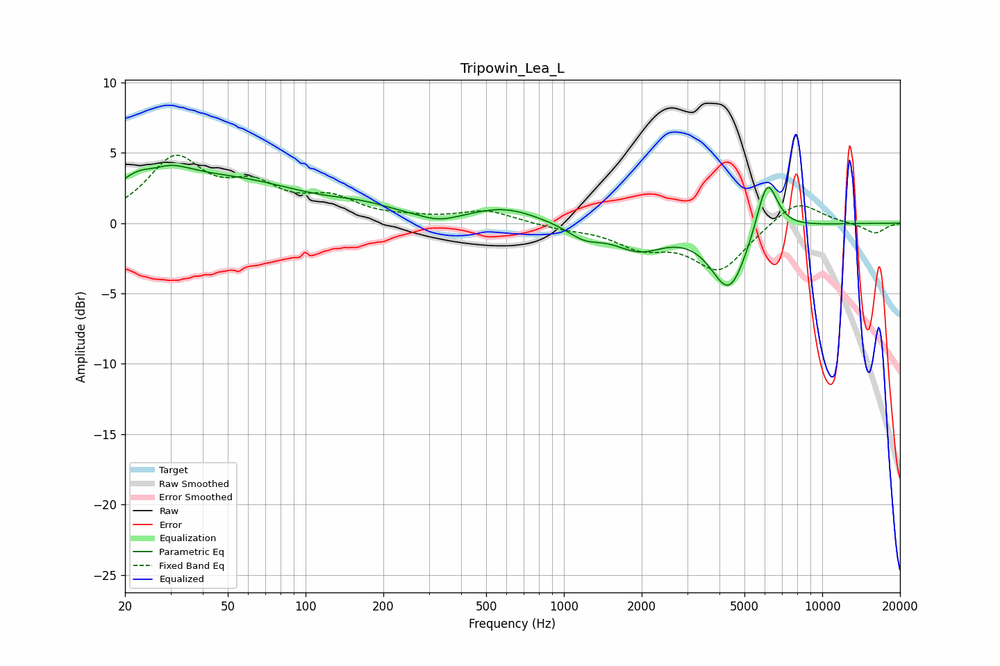

# Tripowin_Lea_L
See [usage instructions](https://github.com/jaakkopasanen/AutoEq#usage) for more options and info.

### Parametric EQs
Apply preamp of -4.2 dB when using parametric equalizer.

|   # | Type    |   Fc (Hz) |    Q |   Gain (dB) |
|-----|---------|-----------|------|-------------|
|   1 | Peaking |        26 | 1.36 |         4   |
|   2 | Peaking |        26 | 2.29 |        -1.7 |
|   3 | Peaking |        54 | 0.51 |         2.7 |
|   4 | Peaking |       166 | 1.09 |         0.6 |
|   5 | Peaking |       329 | 1.93 |        -0.5 |
|   6 | Peaking |       590 | 1.08 |         1.1 |
|   7 | Peaking |      1199 | 2.15 |        -0.9 |
|   8 | Peaking |      1951 | 1.42 |        -1.7 |
|   9 | Peaking |      4363 | 1.98 |        -4.7 |
|  10 | Peaking |      6114 | 3.39 |         4.1 |

### Fixed Band EQs
When using fixed band (also called graphic) equalizer, apply preamp of **-4.9 dB** (if available) and set gains manually with these parameters.

|   # | Type    |   Fc (Hz) |    Q |   Gain (dB) |
|-----|---------|-----------|------|-------------|
|   1 | Peaking |        31 | 1.41 |         4.4 |
|   2 | Peaking |        62 | 1.41 |         2.2 |
|   3 | Peaking |       125 | 1.41 |         1.5 |
|   4 | Peaking |       250 | 1.41 |         0.2 |
|   5 | Peaking |       500 | 1.41 |         0.9 |
|   6 | Peaking |      1000 | 1.41 |        -0.3 |
|   7 | Peaking |      2000 | 1.41 |        -1.5 |
|   8 | Peaking |      4000 | 1.41 |        -3.3 |
|   9 | Peaking |      8000 | 1.41 |         1.8 |
|  10 | Peaking |     16000 | 1.41 |        -0.7 |

### Graphs

