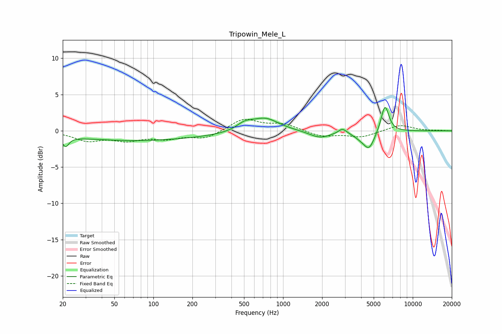

# Tripowin_Mele_L
See [usage instructions](https://github.com/jaakkopasanen/AutoEq#usage) for more options and info.

### Parametric EQs
Apply preamp of -3.3 dB when using parametric equalizer.

|   # | Type    |   Fc (Hz) |    Q |   Gain (dB) |
|-----|---------|-----------|------|-------------|
|   1 | Peaking |        21 | 5.86 |        -1.3 |
|   2 | Peaking |        26 | 0.24 |        -0.6 |
|   3 | Peaking |       115 | 0.3  |        -1   |
|   4 | Peaking |       506 | 2.28 |         0.9 |
|   5 | Peaking |       727 | 1.34 |         1.8 |
|   6 | Peaking |      1928 | 1.71 |        -1   |
|   7 | Peaking |      2873 | 4.51 |         0.7 |
|   8 | Peaking |      3930 | 2.7  |        -0.5 |
|   9 | Peaking |      4607 | 3.23 |        -2.4 |
|  10 | Peaking |      6103 | 4.54 |         3.8 |

### Fixed Band EQs
When using fixed band (also called graphic) equalizer, apply preamp of **-1.7 dB** (if available) and set gains manually with these parameters.

|   # | Type    |   Fc (Hz) |    Q |   Gain (dB) |
|-----|---------|-----------|------|-------------|
|   1 | Peaking |        31 | 1.41 |        -1.3 |
|   2 | Peaking |        62 | 1.41 |        -1.1 |
|   3 | Peaking |       125 | 1.41 |        -0.9 |
|   4 | Peaking |       250 | 1.41 |        -1   |
|   5 | Peaking |       500 | 1.41 |         1.7 |
|   6 | Peaking |      1000 | 1.41 |         0.9 |
|   7 | Peaking |      2000 | 1.41 |        -0.8 |
|   8 | Peaking |      4000 | 1.41 |        -0.8 |
|   9 | Peaking |      8000 | 1.41 |         0.8 |
|  10 | Peaking |     16000 | 1.41 |         0   |

### Graphs

