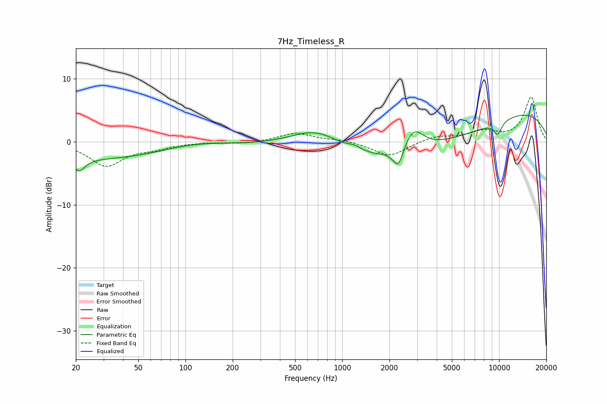

# 7Hz_Timeless_R
See [usage instructions](https://github.com/jaakkopasanen/AutoEq#usage) for more options and info.

### Parametric EQs
Apply preamp of -4.3 dB when using parametric equalizer.

|   # | Type    |   Fc (Hz) |    Q |   Gain (dB) |
|-----|---------|-----------|------|-------------|
|   1 | Peaking |        21 | 4.08 |        -1.9 |
|   2 | Peaking |        37 | 0.18 |        -3   |
|   3 | Peaking |       114 | 0.59 |         1.9 |
|   4 | Peaking |       688 | 0.89 |         3.2 |
|   5 | Peaking |      1197 | 3.07 |         0.7 |
|   6 | Peaking |      2277 | 4.37 |        -3.2 |
|   7 | Peaking |      2840 | 2.18 |         3.8 |
|   8 | Peaking |      3870 | 0.25 |        -7   |
|   9 | Peaking |      8887 | 0.24 |         8   |
|  10 | Peaking |      9801 | 4.94 |        -2   |

### Fixed Band EQs
When using fixed band (also called graphic) equalizer, apply preamp of **-7.2 dB** (if available) and set gains manually with these parameters.

|   # | Type    |   Fc (Hz) |    Q |   Gain (dB) |
|-----|---------|-----------|------|-------------|
|   1 | Peaking |        31 | 1.41 |        -3.7 |
|   2 | Peaking |        62 | 1.41 |        -0.9 |
|   3 | Peaking |       125 | 1.41 |        -0   |
|   4 | Peaking |       250 | 1.41 |        -0.3 |
|   5 | Peaking |       500 | 1.41 |         1.4 |
|   6 | Peaking |      1000 | 1.41 |         0.3 |
|   7 | Peaking |      2000 | 1.41 |        -2.4 |
|   8 | Peaking |      4000 | 1.41 |         0.9 |
|   9 | Peaking |      8000 | 1.41 |         1.5 |
|  10 | Peaking |     16000 | 1.41 |         7   |

### Graphs

