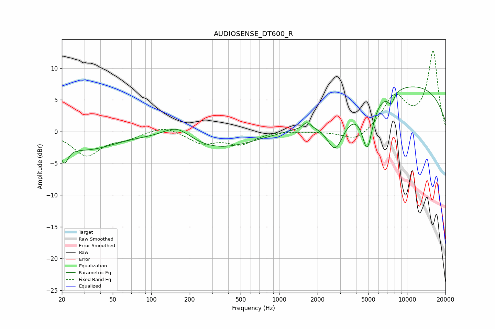

# AUDIOSENSE_DT600_R
See [usage instructions](https://github.com/jaakkopasanen/AutoEq#usage) for more options and info.

### Parametric EQs
Apply preamp of -7.2 dB when using parametric equalizer.

|   # | Type    |   Fc (Hz) |    Q |   Gain (dB) |
|-----|---------|-----------|------|-------------|
|   1 | Peaking |        21 | 4.66 |        -2.9 |
|   2 | Peaking |        31 | 0.65 |        -2.7 |
|   3 | Peaking |       159 | 1.29 |         2.3 |
|   4 | Peaking |       320 | 0.49 |        -2.7 |
|   5 | Peaking |      1651 | 5.23 |         1   |
|   6 | Peaking |      2751 | 2.11 |        -5.5 |
|   7 | Peaking |      4890 | 3.38 |        -7.5 |
|   8 | Peaking |      7509 | 5    |        -1.8 |
|   9 | Peaking |      9971 | 0.25 |         0.4 |
|  10 | Peaking |     10000 | 0.25 |         6.9 |

### Fixed Band EQs
When using fixed band (also called graphic) equalizer, apply preamp of **-12.8 dB** (if available) and set gains manually with these parameters.

|   # | Type    |   Fc (Hz) |    Q |   Gain (dB) |
|-----|---------|-----------|------|-------------|
|   1 | Peaking |        31 | 1.41 |        -3.7 |
|   2 | Peaking |        62 | 1.41 |        -0.9 |
|   3 | Peaking |       125 | 1.41 |         1   |
|   4 | Peaking |       250 | 1.41 |        -1.8 |
|   5 | Peaking |       500 | 1.41 |        -1.9 |
|   6 | Peaking |      1000 | 1.41 |         0.2 |
|   7 | Peaking |      2000 | 1.41 |        -0   |
|   8 | Peaking |      4000 | 1.41 |        -1.7 |
|   9 | Peaking |      8000 | 1.41 |         5.3 |
|  10 | Peaking |     16000 | 1.41 |        12.6 |

### Graphs

