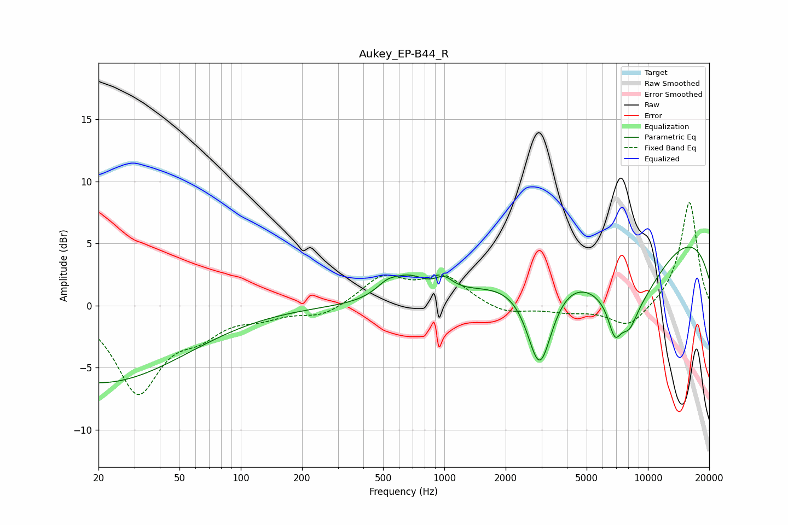

# Aukey_EP-B44_R
See [usage instructions](https://github.com/jaakkopasanen/AutoEq#usage) for more options and info.

### Parametric EQs
Apply preamp of -4.8 dB when using parametric equalizer.

|   # | Type    |   Fc (Hz) |    Q |   Gain (dB) |
|-----|---------|-----------|------|-------------|
|   1 | Peaking |        20 | 0.33 |        -6.2 |
|   2 | Peaking |       553 | 2.34 |         2.3 |
|   3 | Peaking |       564 | 3.07 |        -1   |
|   4 | Peaking |       695 | 1.86 |         1.2 |
|   5 | Peaking |       995 | 3.17 |         1   |
|   6 | Peaking |      2940 | 2.22 |        -7.5 |
|   7 | Peaking |      6874 | 4.34 |        -2.4 |
|   8 | Peaking |      8062 | 0.73 |        -6.4 |
|   9 | Peaking |      8078 | 3.31 |        -1.5 |
|  10 | Peaking |     10000 | 0.19 |         6.9 |

### Fixed Band EQs
When using fixed band (also called graphic) equalizer, apply preamp of **-8.4 dB** (if available) and set gains manually with these parameters.

|   # | Type    |   Fc (Hz) |    Q |   Gain (dB) |
|-----|---------|-----------|------|-------------|
|   1 | Peaking |        31 | 1.41 |        -6.8 |
|   2 | Peaking |        62 | 1.41 |        -1.8 |
|   3 | Peaking |       125 | 1.41 |        -0.7 |
|   4 | Peaking |       250 | 1.41 |        -0.9 |
|   5 | Peaking |       500 | 1.41 |         2.2 |
|   6 | Peaking |      1000 | 1.41 |         2.2 |
|   7 | Peaking |      2000 | 1.41 |        -0.7 |
|   8 | Peaking |      4000 | 1.41 |        -0.4 |
|   9 | Peaking |      8000 | 1.41 |        -1.8 |
|  10 | Peaking |     16000 | 1.41 |         8.4 |

### Graphs

