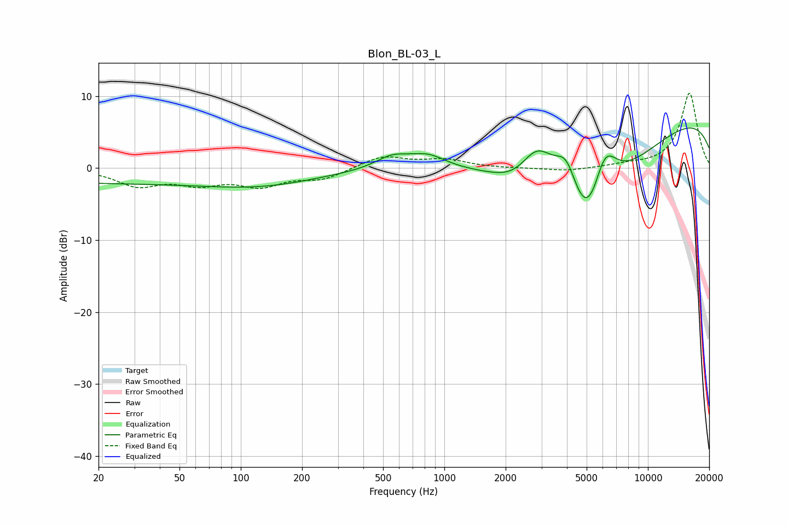

# Blon_BL-03_L
See [usage instructions](https://github.com/jaakkopasanen/AutoEq#usage) for more options and info.

### Parametric EQs
Apply preamp of -5.7 dB when using parametric equalizer.

|   # | Type    |   Fc (Hz) |    Q |   Gain (dB) |
|-----|---------|-----------|------|-------------|
|   1 | Peaking |        20 | 0.23 |        -1.9 |
|   2 | Peaking |       132 | 0.51 |        -1.9 |
|   3 | Peaking |       557 | 1.67 |         1.7 |
|   4 | Peaking |       831 | 1.62 |         1.7 |
|   5 | Peaking |      2365 | 1.22 |        -3   |
|   6 | Peaking |      2838 | 1.46 |         7.1 |
|   7 | Peaking |      3981 | 2.46 |         5.5 |
|   8 | Peaking |      5095 | 0.76 |       -19.7 |
|   9 | Peaking |      6114 | 2.01 |         8.6 |
|  10 | Peaking |     10000 | 0.18 |         8.5 |

### Fixed Band EQs
When using fixed band (also called graphic) equalizer, apply preamp of **-10.5 dB** (if available) and set gains manually with these parameters.

|   # | Type    |   Fc (Hz) |    Q |   Gain (dB) |
|-----|---------|-----------|------|-------------|
|   1 | Peaking |        31 | 1.41 |        -2.3 |
|   2 | Peaking |        62 | 1.41 |        -1.9 |
|   3 | Peaking |       125 | 1.41 |        -2.2 |
|   4 | Peaking |       250 | 1.41 |        -1.4 |
|   5 | Peaking |       500 | 1.41 |         1.7 |
|   6 | Peaking |      1000 | 1.41 |         1.1 |
|   7 | Peaking |      2000 | 1.41 |        -0.1 |
|   8 | Peaking |      4000 | 1.41 |        -0.4 |
|   9 | Peaking |      8000 | 1.41 |         0.4 |
|  10 | Peaking |     16000 | 1.41 |        10.5 |

### Graphs

