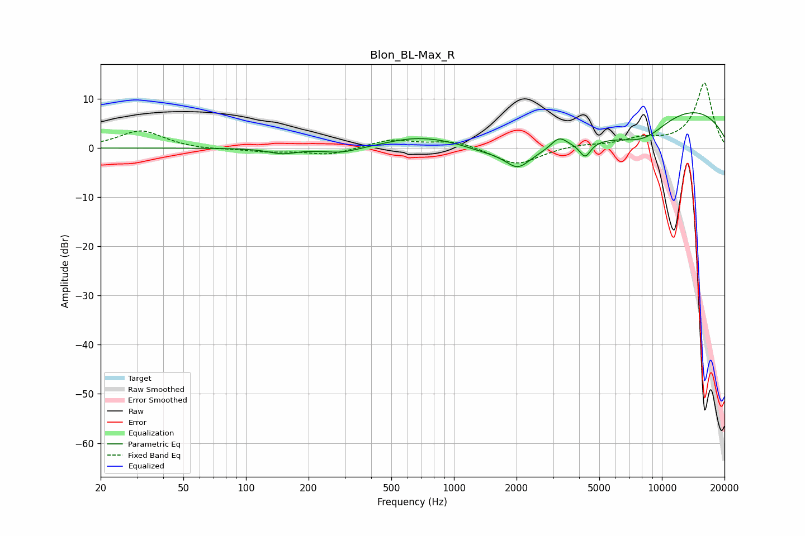

# Blon_BL-Max_R
See [usage instructions](https://github.com/jaakkopasanen/AutoEq#usage) for more options and info.

### Parametric EQs
Apply preamp of -7.3 dB when using parametric equalizer.

|   # | Type    |   Fc (Hz) |    Q |   Gain (dB) |
|-----|---------|-----------|------|-------------|
|   1 | Peaking |       150 | 2.11 |        -1.1 |
|   2 | Peaking |       288 | 1.58 |        -1.1 |
|   3 | Peaking |       659 | 0.92 |         2.4 |
|   4 | Peaking |       961 | 1.29 |         0.9 |
|   5 | Peaking |      2027 | 2.51 |        -3.2 |
|   6 | Peaking |      3203 | 3.58 |         2.4 |
|   7 | Peaking |      3773 | 0.32 |        -5.3 |
|   8 | Peaking |      4275 | 5.32 |        -3   |
|   9 | Peaking |      8173 | 1.06 |        -4.4 |
|  10 | Peaking |     10000 | 0.26 |        10.5 |

### Fixed Band EQs
When using fixed band (also called graphic) equalizer, apply preamp of **-13.3 dB** (if available) and set gains manually with these parameters.

|   # | Type    |   Fc (Hz) |    Q |   Gain (dB) |
|-----|---------|-----------|------|-------------|
|   1 | Peaking |        31 | 1.41 |         3.6 |
|   2 | Peaking |        62 | 1.41 |        -0.4 |
|   3 | Peaking |       125 | 1.41 |        -0.7 |
|   4 | Peaking |       250 | 1.41 |        -1.4 |
|   5 | Peaking |       500 | 1.41 |         1.7 |
|   6 | Peaking |      1000 | 1.41 |         1.5 |
|   7 | Peaking |      2000 | 1.41 |        -3.5 |
|   8 | Peaking |      4000 | 1.41 |         0.7 |
|   9 | Peaking |      8000 | 1.41 |         1.6 |
|  10 | Peaking |     16000 | 1.41 |        13.2 |

### Graphs

