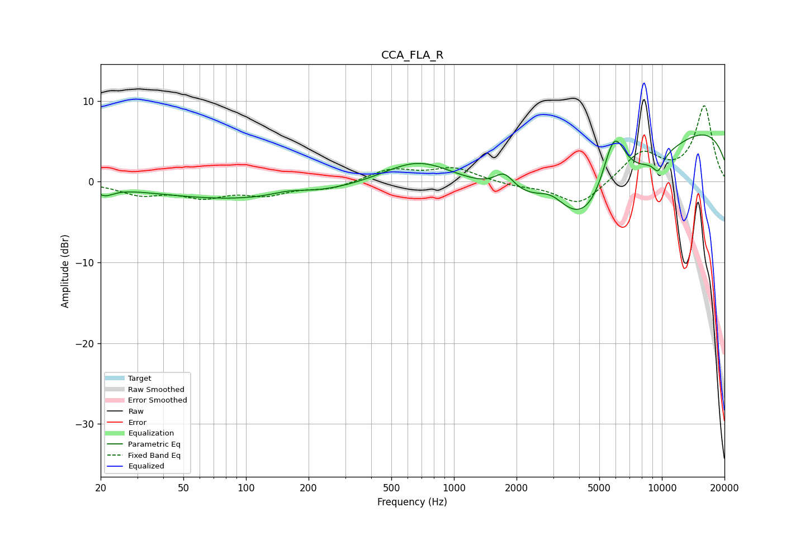

# CCA_FLA_R
See [usage instructions](https://github.com/jaakkopasanen/AutoEq#usage) for more options and info.

### Parametric EQs
Apply preamp of -5.9 dB when using parametric equalizer.

|   # | Type    |   Fc (Hz) |    Q |   Gain (dB) |
|-----|---------|-----------|------|-------------|
|   1 | Peaking |        21 | 3.39 |        -1   |
|   2 | Peaking |       102 | 0.3  |        -2.2 |
|   3 | Peaking |       161 | 1.54 |         0.7 |
|   4 | Peaking |       673 | 0.84 |         3.1 |
|   5 | Peaking |      1744 | 3.06 |         2   |
|   6 | Peaking |      2942 | 1.95 |         2   |
|   7 | Peaking |      4497 | 0.51 |       -13.9 |
|   8 | Peaking |      5872 | 2.18 |         8.9 |
|   9 | Peaking |      9557 | 0.18 |         8.7 |
|  10 | Peaking |      9601 | 4.82 |        -1.8 |

### Fixed Band EQs
When using fixed band (also called graphic) equalizer, apply preamp of **-9.5 dB** (if available) and set gains manually with these parameters.

|   # | Type    |   Fc (Hz) |    Q |   Gain (dB) |
|-----|---------|-----------|------|-------------|
|   1 | Peaking |        31 | 1.41 |        -1.5 |
|   2 | Peaking |        62 | 1.41 |        -1.7 |
|   3 | Peaking |       125 | 1.41 |        -1.4 |
|   4 | Peaking |       250 | 1.41 |        -0.9 |
|   5 | Peaking |       500 | 1.41 |         1.5 |
|   6 | Peaking |      1000 | 1.41 |         1.6 |
|   7 | Peaking |      2000 | 1.41 |        -0.5 |
|   8 | Peaking |      4000 | 1.41 |        -3   |
|   9 | Peaking |      8000 | 1.41 |         3.6 |
|  10 | Peaking |     16000 | 1.41 |         9.3 |

### Graphs

