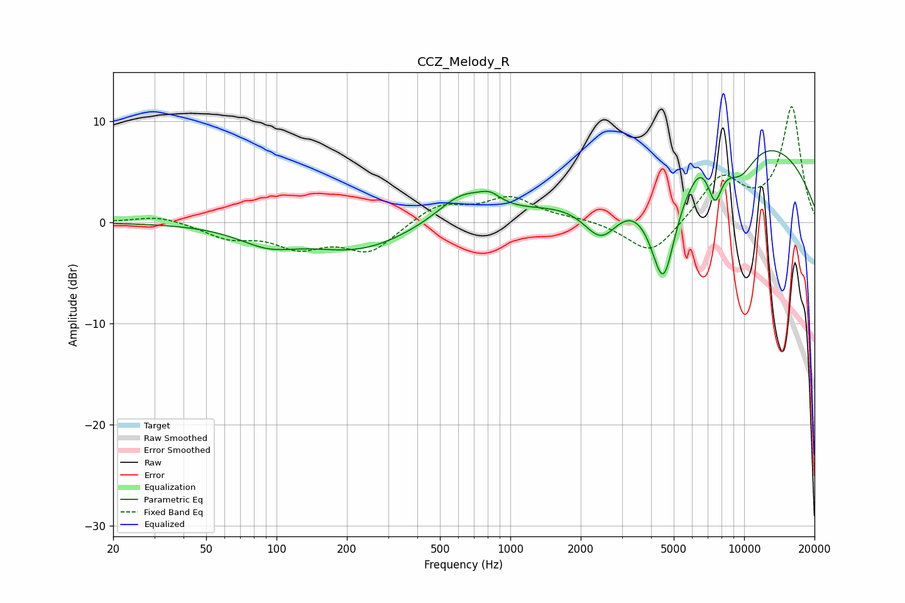

# CCZ_Melody_R
See [usage instructions](https://github.com/jaakkopasanen/AutoEq#usage) for more options and info.

### Parametric EQs
Apply preamp of -7.2 dB when using parametric equalizer.

|   # | Type    |   Fc (Hz) |    Q |   Gain (dB) |
|-----|---------|-----------|------|-------------|
|   1 | Peaking |        92 | 1.13 |        -1.7 |
|   2 | Peaking |       224 | 0.65 |        -2.7 |
|   3 | Peaking |       623 | 1.3  |         2.8 |
|   4 | Peaking |       819 | 3.04 |         1   |
|   5 | Peaking |      2452 | 1.76 |        -4.5 |
|   6 | Peaking |      4513 | 2.28 |       -11.5 |
|   7 | Peaking |      6459 | 3.69 |         0.8 |
|   8 | Peaking |      7512 | 4.39 |        -3.9 |
|   9 | Peaking |      8949 | 0.25 |         9.1 |
|  10 | Peaking |      9603 | 1.75 |        -3.4 |

### Fixed Band EQs
When using fixed band (also called graphic) equalizer, apply preamp of **-11.5 dB** (if available) and set gains manually with these parameters.

|   # | Type    |   Fc (Hz) |    Q |   Gain (dB) |
|-----|---------|-----------|------|-------------|
|   1 | Peaking |        31 | 1.41 |         0.7 |
|   2 | Peaking |        62 | 1.41 |        -1.4 |
|   3 | Peaking |       125 | 1.41 |        -2.2 |
|   4 | Peaking |       250 | 1.41 |        -2.8 |
|   5 | Peaking |       500 | 1.41 |         1.8 |
|   6 | Peaking |      1000 | 1.41 |         2.3 |
|   7 | Peaking |      2000 | 1.41 |         0.3 |
|   8 | Peaking |      4000 | 1.41 |        -3.4 |
|   9 | Peaking |      8000 | 1.41 |         4.4 |
|  10 | Peaking |     16000 | 1.41 |        11.3 |

### Graphs

