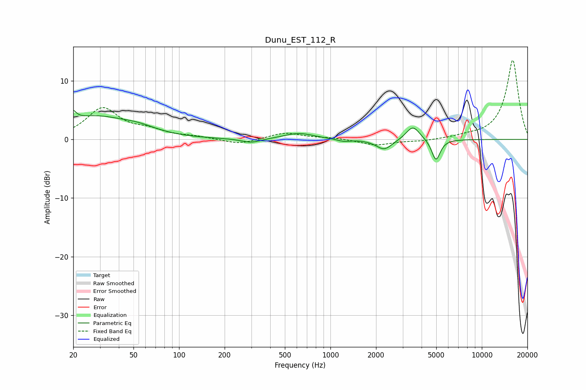

# Dunu_EST_112_R
See [usage instructions](https://github.com/jaakkopasanen/AutoEq#usage) for more options and info.

### Parametric EQs
Apply preamp of -5.1 dB when using parametric equalizer.

|   # | Type    |   Fc (Hz) |    Q |   Gain (dB) |
|-----|---------|-----------|------|-------------|
|   1 | Peaking |        20 | 6    |         4.3 |
|   2 | Peaking |        20 | 6    |        -2.6 |
|   3 | Peaking |        27 | 0.64 |         3.7 |
|   4 | Peaking |        54 | 1.2  |         0.9 |
|   5 | Peaking |       300 | 2.21 |        -0.7 |
|   6 | Peaking |       618 | 1.44 |         1.1 |
|   7 | Peaking |      1221 | 3.25 |        -0.4 |
|   8 | Peaking |      2266 | 2.66 |        -1.8 |
|   9 | Peaking |      3506 | 3.15 |         2.4 |
|  10 | Peaking |      4977 | 4.97 |        -3.7 |

### Fixed Band EQs
When using fixed band (also called graphic) equalizer, apply preamp of **-13.6 dB** (if available) and set gains manually with these parameters.

|   # | Type    |   Fc (Hz) |    Q |   Gain (dB) |
|-----|---------|-----------|------|-------------|
|   1 | Peaking |        31 | 1.41 |         5.2 |
|   2 | Peaking |        62 | 1.41 |         1.3 |
|   3 | Peaking |       125 | 1.41 |         0.4 |
|   4 | Peaking |       250 | 1.41 |        -0.9 |
|   5 | Peaking |       500 | 1.41 |         1.1 |
|   6 | Peaking |      1000 | 1.41 |         0.3 |
|   7 | Peaking |      2000 | 1.41 |        -1   |
|   8 | Peaking |      4000 | 1.41 |        -0.3 |
|   9 | Peaking |      8000 | 1.41 |         0.4 |
|  10 | Peaking |     16000 | 1.41 |        13.6 |

### Graphs

