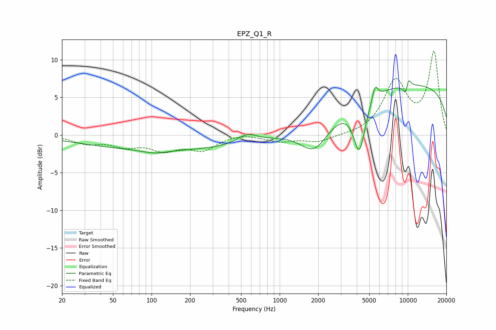

# EPZ_Q1_R
See [usage instructions](https://github.com/jaakkopasanen/AutoEq#usage) for more options and info.

### Parametric EQs
Apply preamp of -7.3 dB when using parametric equalizer.

|   # | Type    |   Fc (Hz) |    Q |   Gain (dB) |
|-----|---------|-----------|------|-------------|
|   1 | Peaking |       105 | 1.48 |        -0.5 |
|   2 | Peaking |       138 | 1.41 |        -0   |
|   3 | Peaking |       140 | 0.18 |        -2   |
|   4 | Peaking |       558 | 1.79 |         1.2 |
|   5 | Peaking |      1876 | 1.22 |        -4.2 |
|   6 | Peaking |      4184 | 3.01 |        -6.8 |
|   7 | Peaking |      5559 | 6    |         2   |
|   8 | Peaking |      9701 | 6    |        -2.4 |
|   9 | Peaking |     10000 | 0.18 |         6.8 |
|  10 | Peaking |     10000 | 5.99 |         2.2 |

### Fixed Band EQs
When using fixed band (also called graphic) equalizer, apply preamp of **-11.2 dB** (if available) and set gains manually with these parameters.

|   # | Type    |   Fc (Hz) |    Q |   Gain (dB) |
|-----|---------|-----------|------|-------------|
|   1 | Peaking |        31 | 1.41 |        -1   |
|   2 | Peaking |        62 | 1.41 |        -1.3 |
|   3 | Peaking |       125 | 1.41 |        -1.8 |
|   4 | Peaking |       250 | 1.41 |        -1.8 |
|   5 | Peaking |       500 | 1.41 |         0.3 |
|   6 | Peaking |      1000 | 1.41 |        -0.8 |
|   7 | Peaking |      2000 | 1.41 |        -0.9 |
|   8 | Peaking |      4000 | 1.41 |        -0.1 |
|   9 | Peaking |      8000 | 1.41 |         6.9 |
|  10 | Peaking |     16000 | 1.41 |        10.9 |

### Graphs

