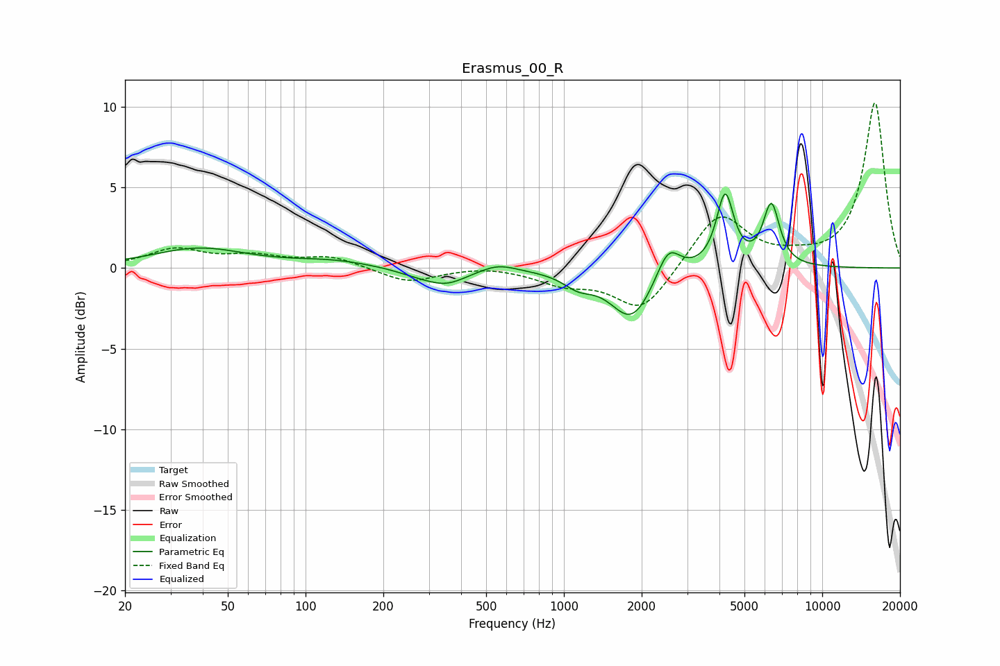

# Erasmus_00_R
See [usage instructions](https://github.com/jaakkopasanen/AutoEq#usage) for more options and info.

### Parametric EQs
Apply preamp of -4.7 dB when using parametric equalizer.

|   # | Type    |   Fc (Hz) |    Q |   Gain (dB) |
|-----|---------|-----------|------|-------------|
|   1 | Peaking |        39 | 0.79 |         1.2 |
|   2 | Peaking |       128 | 0.91 |         0.4 |
|   3 | Peaking |       271 | 1.57 |        -0.3 |
|   4 | Peaking |       351 | 1.73 |        -0.9 |
|   5 | Peaking |       556 | 2.06 |         0.5 |
|   6 | Peaking |      1136 | 2.46 |        -0.8 |
|   7 | Peaking |      1830 | 1.73 |        -3.2 |
|   8 | Peaking |      2535 | 3.13 |         2   |
|   9 | Peaking |      4208 | 4.26 |         4.5 |
|  10 | Peaking |      6353 | 4.3  |         3.8 |

### Fixed Band EQs
When using fixed band (also called graphic) equalizer, apply preamp of **-10.3 dB** (if available) and set gains manually with these parameters.

|   # | Type    |   Fc (Hz) |    Q |   Gain (dB) |
|-----|---------|-----------|------|-------------|
|   1 | Peaking |        31 | 1.41 |         1.1 |
|   2 | Peaking |        62 | 1.41 |         0.6 |
|   3 | Peaking |       125 | 1.41 |         0.7 |
|   4 | Peaking |       250 | 1.41 |        -0.9 |
|   5 | Peaking |       500 | 1.41 |         0.2 |
|   6 | Peaking |      1000 | 1.41 |        -0.9 |
|   7 | Peaking |      2000 | 1.41 |        -2.8 |
|   8 | Peaking |      4000 | 1.41 |         3.5 |
|   9 | Peaking |      8000 | 1.41 |         0.4 |
|  10 | Peaking |     16000 | 1.41 |        10.3 |

### Graphs

