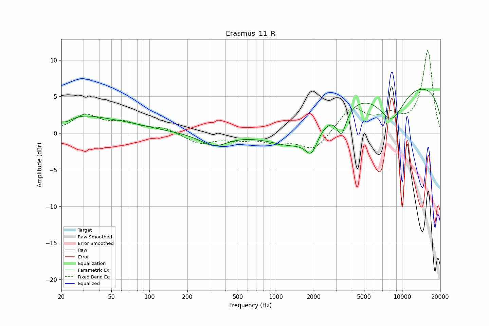

# Erasmus_11_R
See [usage instructions](https://github.com/jaakkopasanen/AutoEq#usage) for more options and info.

### Parametric EQs
Apply preamp of -6.1 dB when using parametric equalizer.

|   # | Type    |   Fc (Hz) |    Q |   Gain (dB) |
|-----|---------|-----------|------|-------------|
|   1 | Peaking |        22 | 2.14 |        -0.2 |
|   2 | Peaking |        22 | 2.8  |        -0.5 |
|   3 | Peaking |        27 | 0.65 |         2.2 |
|   4 | Peaking |        67 | 0.65 |         0.8 |
|   5 | Peaking |       324 | 1.33 |        -1.7 |
|   6 | Peaking |      1437 | 0.76 |        -3.1 |
|   7 | Peaking |      1916 | 2.91 |        -2.9 |
|   8 | Peaking |      3321 | 3.71 |        -3.5 |
|   9 | Peaking |      8252 | 1.25 |        -4.8 |
|  10 | Peaking |     10000 | 0.18 |         7.1 |

### Fixed Band EQs
When using fixed band (also called graphic) equalizer, apply preamp of **-11.4 dB** (if available) and set gains manually with these parameters.

|   # | Type    |   Fc (Hz) |    Q |   Gain (dB) |
|-----|---------|-----------|------|-------------|
|   1 | Peaking |        31 | 1.41 |         2.4 |
|   2 | Peaking |        62 | 1.41 |         1.2 |
|   3 | Peaking |       125 | 1.41 |         0.7 |
|   4 | Peaking |       250 | 1.41 |        -1.4 |
|   5 | Peaking |       500 | 1.41 |        -0.7 |
|   6 | Peaking |      1000 | 1.41 |        -1.1 |
|   7 | Peaking |      2000 | 1.41 |        -2.4 |
|   8 | Peaking |      4000 | 1.41 |         3.4 |
|   9 | Peaking |      8000 | 1.41 |         1.9 |
|  10 | Peaking |     16000 | 1.41 |        11.3 |

### Graphs

