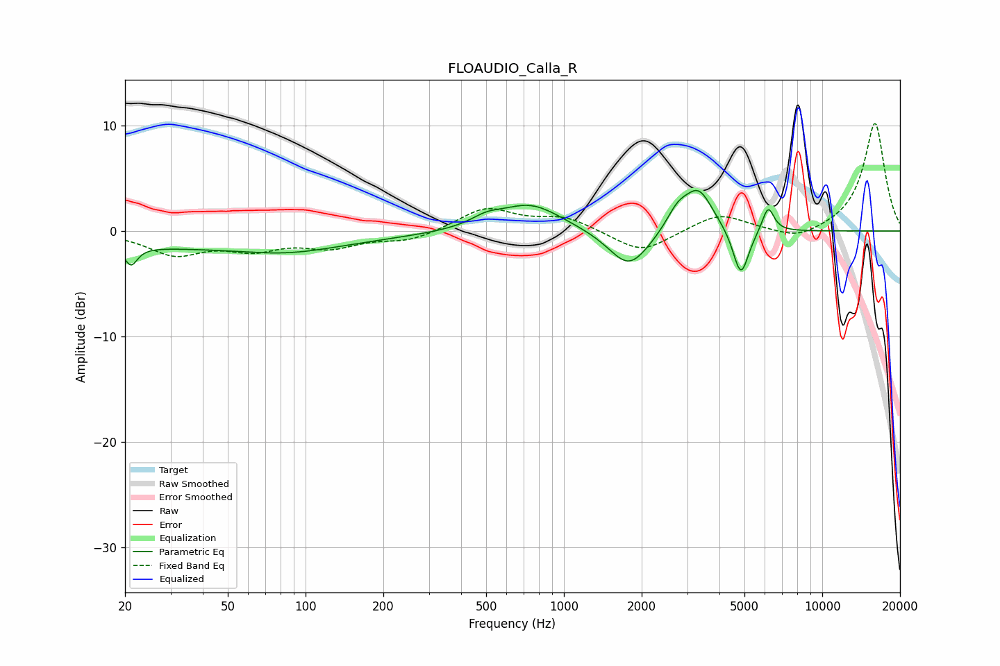

# FLOAUDIO_Calla_R
See [usage instructions](https://github.com/jaakkopasanen/AutoEq#usage) for more options and info.

### Parametric EQs
Apply preamp of -3.9 dB when using parametric equalizer.

|   # | Type    |   Fc (Hz) |    Q |   Gain (dB) |
|-----|---------|-----------|------|-------------|
|   1 | Peaking |        21 | 5.93 |        -1.7 |
|   2 | Peaking |        38 | 0.19 |        -1.5 |
|   3 | Peaking |        86 | 0.82 |        -0.7 |
|   4 | Peaking |       500 | 2.4  |         0.8 |
|   5 | Peaking |       741 | 1.16 |         2.6 |
|   6 | Peaking |      1788 | 1.79 |        -3.7 |
|   7 | Peaking |      2752 | 3.21 |         1.8 |
|   8 | Peaking |      3325 | 2.51 |         3.9 |
|   9 | Peaking |      4842 | 4.55 |        -4.6 |
|  10 | Peaking |      6171 | 6    |         2.5 |

### Fixed Band EQs
When using fixed band (also called graphic) equalizer, apply preamp of **-10.3 dB** (if available) and set gains manually with these parameters.

|   # | Type    |   Fc (Hz) |    Q |   Gain (dB) |
|-----|---------|-----------|------|-------------|
|   1 | Peaking |        31 | 1.41 |        -2.1 |
|   2 | Peaking |        62 | 1.41 |        -1.5 |
|   3 | Peaking |       125 | 1.41 |        -1.4 |
|   4 | Peaking |       250 | 1.41 |        -0.9 |
|   5 | Peaking |       500 | 1.41 |         2.2 |
|   6 | Peaking |      1000 | 1.41 |         1.3 |
|   7 | Peaking |      2000 | 1.41 |        -2.1 |
|   8 | Peaking |      4000 | 1.41 |         1.7 |
|   9 | Peaking |      8000 | 1.41 |        -1   |
|  10 | Peaking |     16000 | 1.41 |        10.3 |

### Graphs

