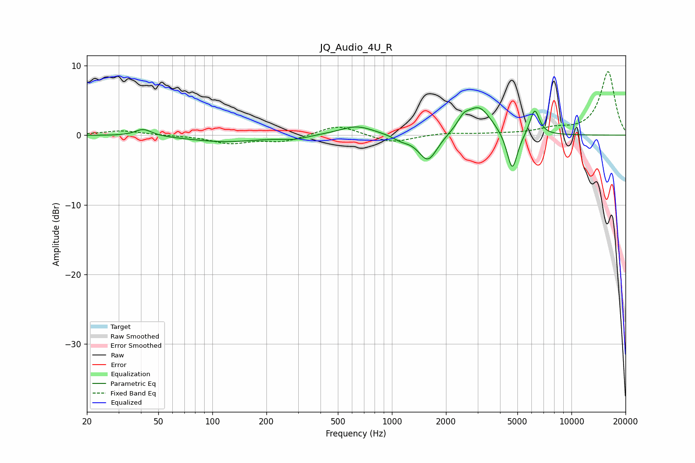

# JQ_Audio_4U_R
See [usage instructions](https://github.com/jaakkopasanen/AutoEq#usage) for more options and info.

### Parametric EQs
Apply preamp of -4.0 dB when using parametric equalizer.

|   # | Type    |   Fc (Hz) |    Q |   Gain (dB) |
|-----|---------|-----------|------|-------------|
|   1 | Peaking |        41 | 3.06 |         1   |
|   2 | Peaking |       117 | 0.71 |        -0.9 |
|   3 | Peaking |       286 | 1.98 |        -0.5 |
|   4 | Peaking |       636 | 1.45 |         1.4 |
|   5 | Peaking |      1125 | 3.14 |        -0.6 |
|   6 | Peaking |      1587 | 2.69 |        -3.9 |
|   7 | Peaking |      2501 | 4.35 |         1.3 |
|   8 | Peaking |      3049 | 1.98 |         4.1 |
|   9 | Peaking |      4680 | 4.71 |        -5.7 |
|  10 | Peaking |      6241 | 5.22 |         3.7 |

### Fixed Band EQs
When using fixed band (also called graphic) equalizer, apply preamp of **-9.2 dB** (if available) and set gains manually with these parameters.

|   # | Type    |   Fc (Hz) |    Q |   Gain (dB) |
|-----|---------|-----------|------|-------------|
|   1 | Peaking |        31 | 1.41 |         0.7 |
|   2 | Peaking |        62 | 1.41 |        -0   |
|   3 | Peaking |       125 | 1.41 |        -1.1 |
|   4 | Peaking |       250 | 1.41 |        -0.9 |
|   5 | Peaking |       500 | 1.41 |         1.5 |
|   6 | Peaking |      1000 | 1.41 |        -1.1 |
|   7 | Peaking |      2000 | 1.41 |         0.3 |
|   8 | Peaking |      4000 | 1.41 |         0.1 |
|   9 | Peaking |      8000 | 1.41 |         0.8 |
|  10 | Peaking |     16000 | 1.41 |         9.1 |

### Graphs

