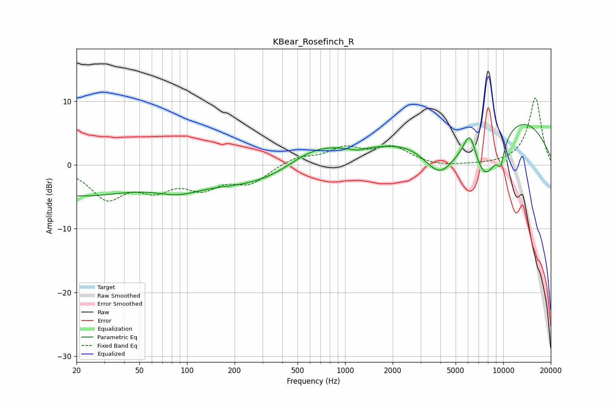

# KBear_Rosefinch_R
See [usage instructions](https://github.com/jaakkopasanen/AutoEq#usage) for more options and info.

### Parametric EQs
Apply preamp of -6.5 dB when using parametric equalizer.

|   # | Type    |   Fc (Hz) |    Q |   Gain (dB) |
|-----|---------|-----------|------|-------------|
|   1 | Peaking |        20 | 0.38 |        -4.6 |
|   2 | Peaking |        87 | 0.94 |        -2.1 |
|   3 | Peaking |       315 | 0.39 |        -3.7 |
|   4 | Peaking |       642 | 0.71 |         4.3 |
|   5 | Peaking |      1200 | 3.15 |        -0.4 |
|   6 | Peaking |      3974 | 1.19 |        -7.5 |
|   7 | Peaking |      6156 | 3.53 |         4.4 |
|   8 | Peaking |      7695 | 1.12 |       -12.2 |
|   9 | Peaking |      7896 | 0.29 |        12.2 |
|  10 | Peaking |      9669 | 5.35 |        -3.2 |

### Fixed Band EQs
When using fixed band (also called graphic) equalizer, apply preamp of **-10.6 dB** (if available) and set gains manually with these parameters.

|   # | Type    |   Fc (Hz) |    Q |   Gain (dB) |
|-----|---------|-----------|------|-------------|
|   1 | Peaking |        31 | 1.41 |        -4.9 |
|   2 | Peaking |        62 | 1.41 |        -3.2 |
|   3 | Peaking |       125 | 1.41 |        -3.1 |
|   4 | Peaking |       250 | 1.41 |        -2.7 |
|   5 | Peaking |       500 | 1.41 |         1.2 |
|   6 | Peaking |      1000 | 1.41 |         2.4 |
|   7 | Peaking |      2000 | 1.41 |         2.6 |
|   8 | Peaking |      4000 | 1.41 |        -0.4 |
|   9 | Peaking |      8000 | 1.41 |        -0   |
|  10 | Peaking |     16000 | 1.41 |        10.6 |

### Graphs

