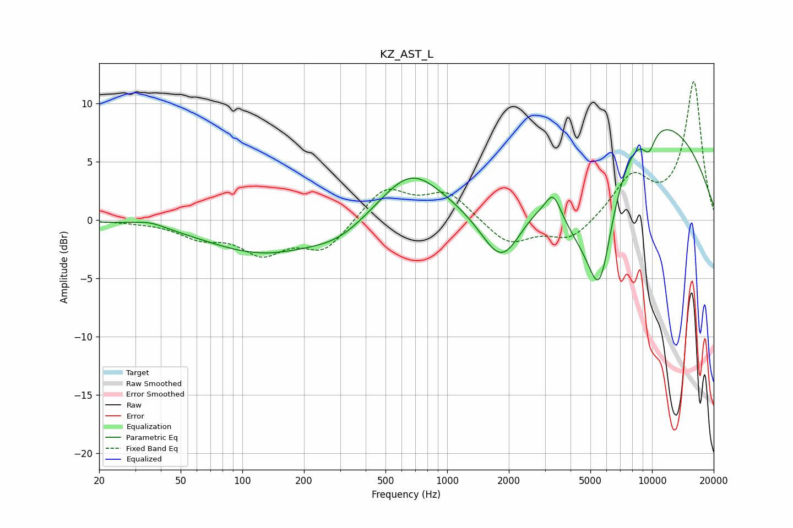

# KZ_AST_L
See [usage instructions](https://github.com/jaakkopasanen/AutoEq#usage) for more options and info.

### Parametric EQs
Apply preamp of -7.8 dB when using parametric equalizer.

|   # | Type    |   Fc (Hz) |    Q |   Gain (dB) |
|-----|---------|-----------|------|-------------|
|   1 | Peaking |        35 | 1.79 |         0.5 |
|   2 | Peaking |       126 | 0.51 |        -2.8 |
|   3 | Peaking |       295 | 1.06 |        -1.2 |
|   4 | Peaking |       664 | 0.93 |         4.1 |
|   5 | Peaking |      1854 | 1.3  |        -6   |
|   6 | Peaking |      3295 | 3.94 |         1.8 |
|   7 | Peaking |      4287 | 1.21 |        -4.5 |
|   8 | Peaking |      5551 | 1.91 |       -10.8 |
|   9 | Peaking |      8177 | 0.28 |        10   |
|  10 | Peaking |      9648 | 4.01 |        -1.8 |

### Fixed Band EQs
When using fixed band (also called graphic) equalizer, apply preamp of **-12.0 dB** (if available) and set gains manually with these parameters.

|   # | Type    |   Fc (Hz) |    Q |   Gain (dB) |
|-----|---------|-----------|------|-------------|
|   1 | Peaking |        31 | 1.41 |        -0.1 |
|   2 | Peaking |        62 | 1.41 |        -1.3 |
|   3 | Peaking |       125 | 1.41 |        -2.6 |
|   4 | Peaking |       250 | 1.41 |        -2.5 |
|   5 | Peaking |       500 | 1.41 |         2.8 |
|   6 | Peaking |      1000 | 1.41 |         2.3 |
|   7 | Peaking |      2000 | 1.41 |        -2.1 |
|   8 | Peaking |      4000 | 1.41 |        -1.8 |
|   9 | Peaking |      8000 | 1.41 |         3.6 |
|  10 | Peaking |     16000 | 1.41 |        11.8 |

### Graphs

