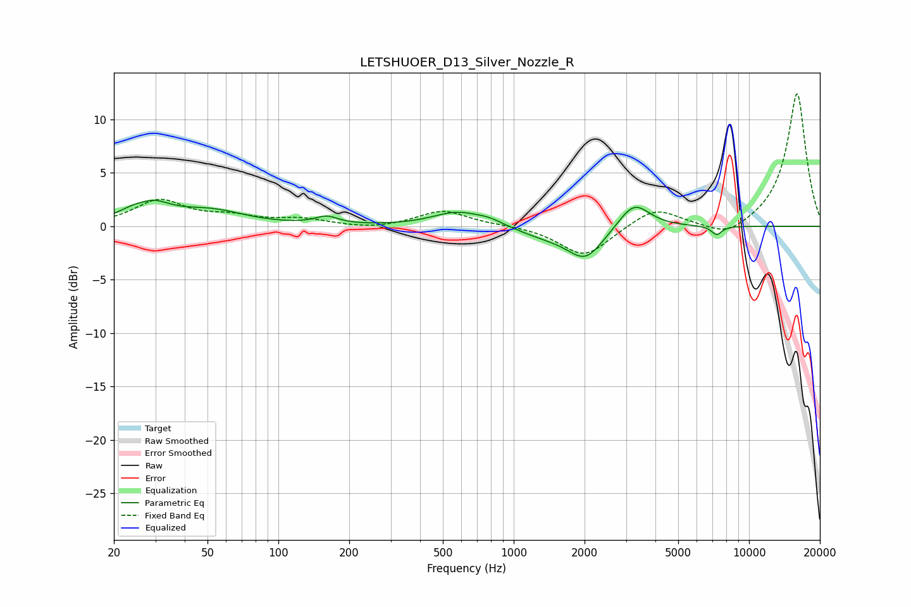

# LETSHUOER_D13_Silver_Nozzle_R
See [usage instructions](https://github.com/jaakkopasanen/AutoEq#usage) for more options and info.

### Parametric EQs
Apply preamp of -2.5 dB when using parametric equalizer.

|   # | Type    |   Fc (Hz) |    Q |   Gain (dB) |
|-----|---------|-----------|------|-------------|
|   1 | Peaking |        27 | 3.38 |        -0.5 |
|   2 | Peaking |        27 | 1.7  |         2.4 |
|   3 | Peaking |        52 | 0.99 |         1.3 |
|   4 | Peaking |       160 | 2.92 |         0.7 |
|   5 | Peaking |       575 | 1.35 |         1.3 |
|   6 | Peaking |       790 | 2.41 |         0.4 |
|   7 | Peaking |      1358 | 1.18 |        -0.8 |
|   8 | Peaking |      2019 | 1.84 |        -2.9 |
|   9 | Peaking |      3244 | 2.14 |         2.5 |
|  10 | Peaking |      7286 | 6    |        -0.8 |

### Fixed Band EQs
When using fixed band (also called graphic) equalizer, apply preamp of **-12.5 dB** (if available) and set gains manually with these parameters.

|   # | Type    |   Fc (Hz) |    Q |   Gain (dB) |
|-----|---------|-----------|------|-------------|
|   1 | Peaking |        31 | 1.41 |         2.4 |
|   2 | Peaking |        62 | 1.41 |         0.8 |
|   3 | Peaking |       125 | 1.41 |         0.6 |
|   4 | Peaking |       250 | 1.41 |        -0.3 |
|   5 | Peaking |       500 | 1.41 |         1.5 |
|   6 | Peaking |      1000 | 1.41 |         0.1 |
|   7 | Peaking |      2000 | 1.41 |        -2.9 |
|   8 | Peaking |      4000 | 1.41 |         1.8 |
|   9 | Peaking |      8000 | 1.41 |        -1.2 |
|  10 | Peaking |     16000 | 1.41 |        12.5 |

### Graphs

