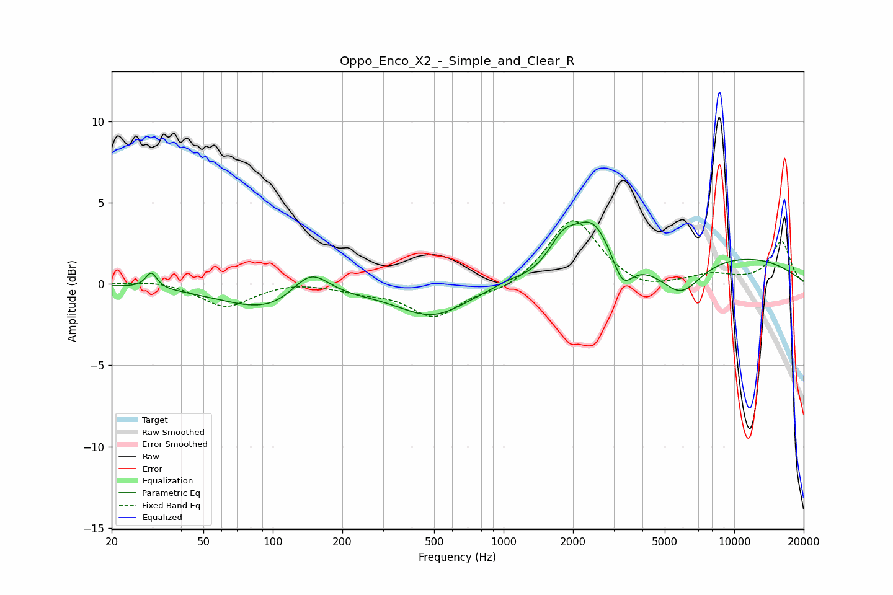

# Oppo_Enco_X2_-_Simple_and_Clear_R
See [usage instructions](https://github.com/jaakkopasanen/AutoEq#usage) for more options and info.

### Parametric EQs
Apply preamp of -3.9 dB when using parametric equalizer.

|   # | Type    |   Fc (Hz) |    Q |   Gain (dB) |
|-----|---------|-----------|------|-------------|
|   1 | Peaking |        30 | 5.96 |         1   |
|   2 | Peaking |       103 | 0.66 |        -1.8 |
|   3 | Peaking |       145 | 1.64 |         2.1 |
|   4 | Peaking |       493 | 0.95 |        -1.9 |
|   5 | Peaking |      1028 | 2.65 |         0.2 |
|   6 | Peaking |      1804 | 2.38 |         1.7 |
|   7 | Peaking |      2427 | 1.63 |         3.2 |
|   8 | Peaking |      3278 | 3.26 |        -1.9 |
|   9 | Peaking |      5878 | 1.55 |        -2.1 |
|  10 | Peaking |      9173 | 0.32 |         1.8 |

### Fixed Band EQs
When using fixed band (also called graphic) equalizer, apply preamp of **-4.0 dB** (if available) and set gains manually with these parameters.

|   # | Type    |   Fc (Hz) |    Q |   Gain (dB) |
|-----|---------|-----------|------|-------------|
|   1 | Peaking |        31 | 1.41 |         0.3 |
|   2 | Peaking |        62 | 1.41 |        -1.4 |
|   3 | Peaking |       125 | 1.41 |         0.2 |
|   4 | Peaking |       250 | 1.41 |        -0.4 |
|   5 | Peaking |       500 | 1.41 |        -2   |
|   6 | Peaking |      1000 | 1.41 |        -0.5 |
|   7 | Peaking |      2000 | 1.41 |         4.1 |
|   8 | Peaking |      4000 | 1.41 |        -0.5 |
|   9 | Peaking |      8000 | 1.41 |         0.5 |
|  10 | Peaking |     16000 | 1.41 |         2.6 |

### Graphs

