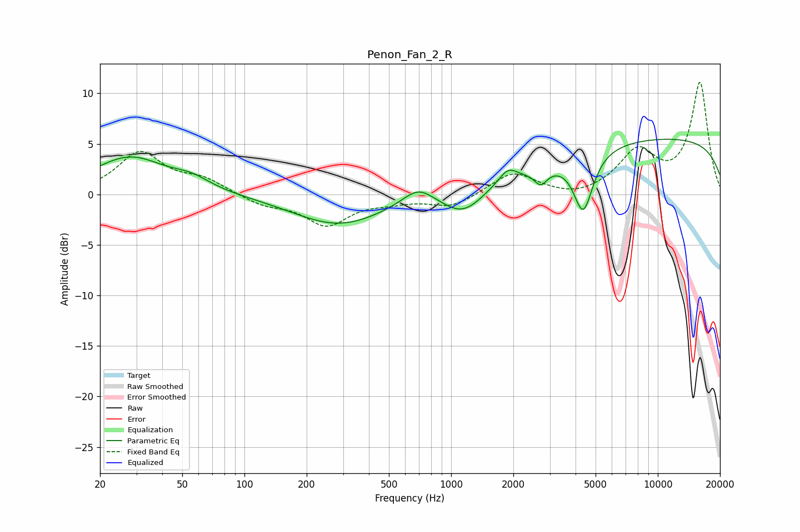

# Penon_Fan_2_R
See [usage instructions](https://github.com/jaakkopasanen/AutoEq#usage) for more options and info.

### Parametric EQs
Apply preamp of -5.6 dB when using parametric equalizer.

|   # | Type    |   Fc (Hz) |    Q |   Gain (dB) |
|-----|---------|-----------|------|-------------|
|   1 | Peaking |        28 | 0.81 |         3.6 |
|   2 | Peaking |        56 | 1.6  |         0.9 |
|   3 | Peaking |       286 | 0.64 |        -3   |
|   4 | Peaking |       693 | 1.91 |         1.7 |
|   5 | Peaking |      1144 | 1.39 |        -2.5 |
|   6 | Peaking |      1883 | 3.2  |         1.3 |
|   7 | Peaking |      2669 | 1.13 |        -0.4 |
|   8 | Peaking |      2716 | 4.66 |        -1.4 |
|   9 | Peaking |      4358 | 3    |        -5.9 |
|  10 | Peaking |     10000 | 0.18 |         5.6 |

### Fixed Band EQs
When using fixed band (also called graphic) equalizer, apply preamp of **-11.2 dB** (if available) and set gains manually with these parameters.

|   # | Type    |   Fc (Hz) |    Q |   Gain (dB) |
|-----|---------|-----------|------|-------------|
|   1 | Peaking |        31 | 1.41 |         4.1 |
|   2 | Peaking |        62 | 1.41 |         1.3 |
|   3 | Peaking |       125 | 1.41 |        -1   |
|   4 | Peaking |       250 | 1.41 |        -2.9 |
|   5 | Peaking |       500 | 1.41 |        -0.5 |
|   6 | Peaking |      1000 | 1.41 |        -1.3 |
|   7 | Peaking |      2000 | 1.41 |         2.2 |
|   8 | Peaking |      4000 | 1.41 |        -0.5 |
|   9 | Peaking |      8000 | 1.41 |         4.1 |
|  10 | Peaking |     16000 | 1.41 |        11   |

### Graphs

