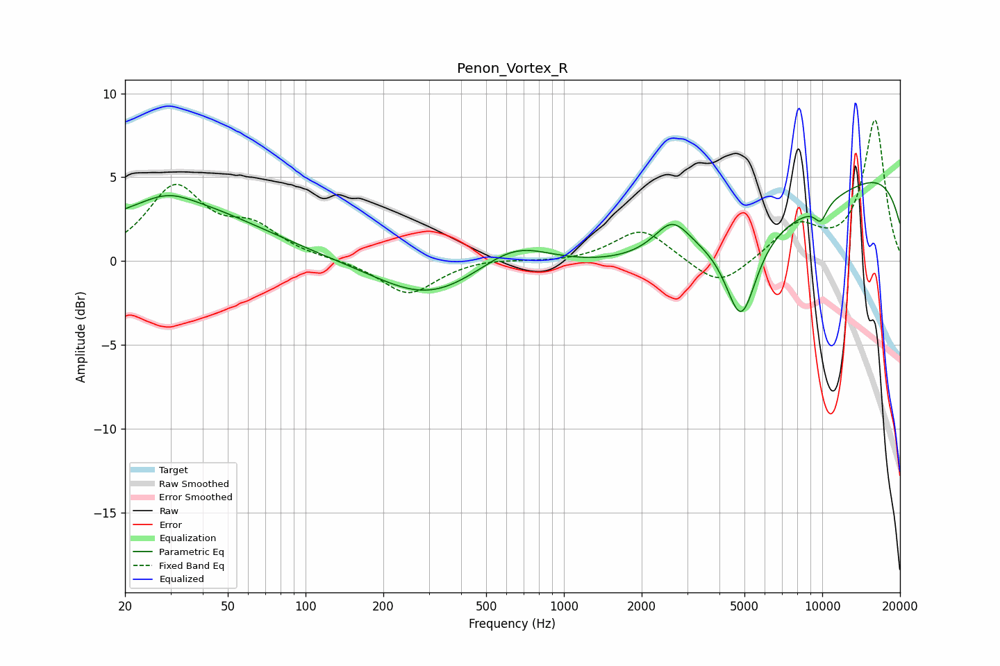

# Penon_Vortex_R
See [usage instructions](https://github.com/jaakkopasanen/AutoEq#usage) for more options and info.

### Parametric EQs
Apply preamp of -4.8 dB when using parametric equalizer.

|   # | Type    |   Fc (Hz) |    Q |   Gain (dB) |
|-----|---------|-----------|------|-------------|
|   1 | Peaking |        27 | 0.38 |         1.6 |
|   2 | Peaking |        29 | 1.56 |         0.7 |
|   3 | Peaking |        34 | 0.48 |         1.7 |
|   4 | Peaking |       299 | 0.7  |        -2.3 |
|   5 | Peaking |       644 | 1.03 |         1.6 |
|   6 | Peaking |      2623 | 2.07 |         1.9 |
|   7 | Peaking |      4853 | 2.34 |        -5.2 |
|   8 | Peaking |      5021 | 0.27 |        -4.1 |
|   9 | Peaking |      9878 | 4.85 |        -1   |
|  10 | Peaking |     10000 | 0.18 |         6.9 |

### Fixed Band EQs
When using fixed band (also called graphic) equalizer, apply preamp of **-8.5 dB** (if available) and set gains manually with these parameters.

|   # | Type    |   Fc (Hz) |    Q |   Gain (dB) |
|-----|---------|-----------|------|-------------|
|   1 | Peaking |        31 | 1.41 |         4.3 |
|   2 | Peaking |        62 | 1.41 |         1.7 |
|   3 | Peaking |       125 | 1.41 |         0.1 |
|   4 | Peaking |       250 | 1.41 |        -2   |
|   5 | Peaking |       500 | 1.41 |         0.2 |
|   6 | Peaking |      1000 | 1.41 |        -0.1 |
|   7 | Peaking |      2000 | 1.41 |         2   |
|   8 | Peaking |      4000 | 1.41 |        -1.7 |
|   9 | Peaking |      8000 | 1.41 |         2   |
|  10 | Peaking |     16000 | 1.41 |         8.4 |

### Graphs

