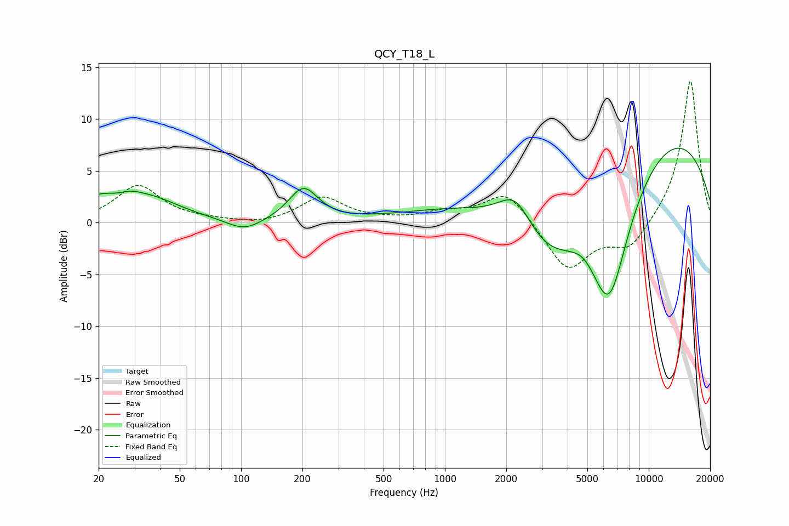

# QCY_T18_L
See [usage instructions](https://github.com/jaakkopasanen/AutoEq#usage) for more options and info.

### Parametric EQs
Apply preamp of -7.3 dB when using parametric equalizer.

|   # | Type    |   Fc (Hz) |    Q |   Gain (dB) |
|-----|---------|-----------|------|-------------|
|   1 | Peaking |        20 | 2.06 |         1.5 |
|   2 | Peaking |        28 | 2.27 |         0.6 |
|   3 | Peaking |        35 | 0.91 |         2.2 |
|   4 | Peaking |       104 | 1.68 |        -1.2 |
|   5 | Peaking |       202 | 1.98 |         3.2 |
|   6 | Peaking |      2231 | 1.63 |         3.9 |
|   7 | Peaking |      3037 | 0.59 |       -10.5 |
|   8 | Peaking |      4762 | 2.49 |         0.8 |
|   9 | Peaking |      6395 | 1.17 |       -14   |
|  10 | Peaking |      6983 | 0.18 |        11.8 |

### Fixed Band EQs
When using fixed band (also called graphic) equalizer, apply preamp of **-13.8 dB** (if available) and set gains manually with these parameters.

|   # | Type    |   Fc (Hz) |    Q |   Gain (dB) |
|-----|---------|-----------|------|-------------|
|   1 | Peaking |        31 | 1.41 |         3.5 |
|   2 | Peaking |        62 | 1.41 |         0.2 |
|   3 | Peaking |       125 | 1.41 |        -0.3 |
|   4 | Peaking |       250 | 1.41 |         2.4 |
|   5 | Peaking |       500 | 1.41 |         0.1 |
|   6 | Peaking |      1000 | 1.41 |         0.8 |
|   7 | Peaking |      2000 | 1.41 |         3.1 |
|   8 | Peaking |      4000 | 1.41 |        -4.7 |
|   9 | Peaking |      8000 | 1.41 |        -2.6 |
|  10 | Peaking |     16000 | 1.41 |        13.9 |

### Graphs

