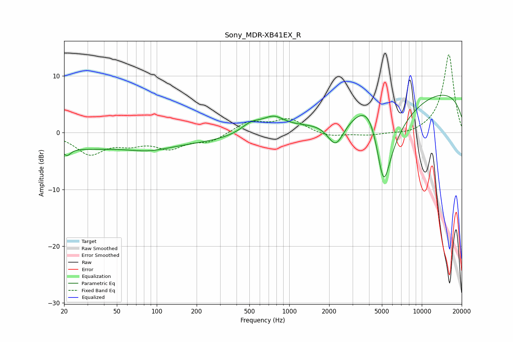

# Sony_MDR-XB41EX_R
See [usage instructions](https://github.com/jaakkopasanen/AutoEq#usage) for more options and info.

### Parametric EQs
Apply preamp of -6.7 dB when using parametric equalizer.

|   # | Type    |   Fc (Hz) |    Q |   Gain (dB) |
|-----|---------|-----------|------|-------------|
|   1 | Peaking |        21 | 4.94 |        -1.4 |
|   2 | Peaking |        21 | 0.48 |        -1   |
|   3 | Peaking |        74 | 0.18 |        -2.1 |
|   4 | Peaking |        88 | 0.97 |        -0.9 |
|   5 | Peaking |       514 | 1.87 |         1.7 |
|   6 | Peaking |       760 | 1.68 |         2.3 |
|   7 | Peaking |      2243 | 2.24 |        -4.7 |
|   8 | Peaking |      4108 | 1.3  |         7.6 |
|   9 | Peaking |      5140 | 1.49 |       -20   |
|  10 | Peaking |     10000 | 0.18 |         8   |

### Fixed Band EQs
When using fixed band (also called graphic) equalizer, apply preamp of **-13.9 dB** (if available) and set gains manually with these parameters.

|   # | Type    |   Fc (Hz) |    Q |   Gain (dB) |
|-----|---------|-----------|------|-------------|
|   1 | Peaking |        31 | 1.41 |        -3.6 |
|   2 | Peaking |        62 | 1.41 |        -1.6 |
|   3 | Peaking |       125 | 1.41 |        -2.5 |
|   4 | Peaking |       250 | 1.41 |        -1.5 |
|   5 | Peaking |       500 | 1.41 |         2   |
|   6 | Peaking |      1000 | 1.41 |         2.3 |
|   7 | Peaking |      2000 | 1.41 |        -0.8 |
|   8 | Peaking |      4000 | 1.41 |        -0.5 |
|   9 | Peaking |      8000 | 1.41 |        -0.5 |
|  10 | Peaking |     16000 | 1.41 |        13.9 |

### Graphs

