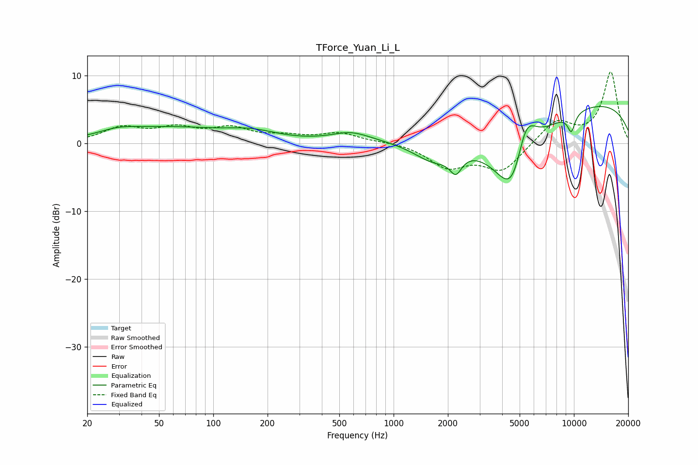

# TForce_Yuan_Li_L
See [usage instructions](https://github.com/jaakkopasanen/AutoEq#usage) for more options and info.

### Parametric EQs
Apply preamp of -5.6 dB when using parametric equalizer.

|   # | Type    |   Fc (Hz) |    Q |   Gain (dB) |
|-----|---------|-----------|------|-------------|
|   1 | Peaking |        30 | 1.23 |         1   |
|   2 | Peaking |        59 | 0.51 |         2.1 |
|   3 | Peaking |       163 | 0.96 |         1.3 |
|   4 | Peaking |       581 | 1.3  |         1.4 |
|   5 | Peaking |      1684 | 1.14 |        -3.6 |
|   6 | Peaking |      2213 | 4.34 |        -2.6 |
|   7 | Peaking |      4621 | 1.14 |       -15.2 |
|   8 | Peaking |      5386 | 2.17 |         8.3 |
|   9 | Peaking |      9121 | 0.18 |         6.8 |
|  10 | Peaking |      9670 | 6    |        -2.6 |

### Fixed Band EQs
When using fixed band (also called graphic) equalizer, apply preamp of **-10.6 dB** (if available) and set gains manually with these parameters.

|   # | Type    |   Fc (Hz) |    Q |   Gain (dB) |
|-----|---------|-----------|------|-------------|
|   1 | Peaking |        31 | 1.41 |         2.2 |
|   2 | Peaking |        62 | 1.41 |         2   |
|   3 | Peaking |       125 | 1.41 |         2   |
|   4 | Peaking |       250 | 1.41 |         0.9 |
|   5 | Peaking |       500 | 1.41 |         1.4 |
|   6 | Peaking |      1000 | 1.41 |         0.3 |
|   7 | Peaking |      2000 | 1.41 |        -3.3 |
|   8 | Peaking |      4000 | 1.41 |        -3.9 |
|   9 | Peaking |      8000 | 1.41 |         3.4 |
|  10 | Peaking |     16000 | 1.41 |        10.5 |

### Graphs

