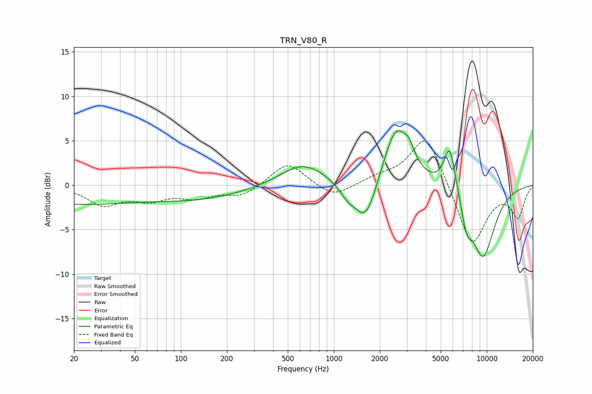

# TRN_V80_R
See [usage instructions](https://github.com/jaakkopasanen/AutoEq#usage) for more options and info.

### Parametric EQs
Apply preamp of -6.2 dB when using parametric equalizer.

|   # | Type    |   Fc (Hz) |    Q |   Gain (dB) |
|-----|---------|-----------|------|-------------|
|   1 | Peaking |        20 | 0.36 |        -2   |
|   2 | Peaking |       131 | 0.44 |        -1.4 |
|   3 | Peaking |       625 | 0.96 |         2.5 |
|   4 | Peaking |      1232 | 2.67 |        -1.3 |
|   5 | Peaking |      1620 | 1.97 |        -4.9 |
|   6 | Peaking |      2555 | 1.67 |         6.8 |
|   7 | Peaking |      3111 | 4.18 |         1.3 |
|   8 | Peaking |      5726 | 3.62 |         5.3 |
|   9 | Peaking |      7384 | 4.32 |        -2.6 |
|  10 | Peaking |      9417 | 1.54 |        -8.1 |

### Fixed Band EQs
When using fixed band (also called graphic) equalizer, apply preamp of **-5.0 dB** (if available) and set gains manually with these parameters.

|   # | Type    |   Fc (Hz) |    Q |   Gain (dB) |
|-----|---------|-----------|------|-------------|
|   1 | Peaking |        31 | 1.41 |        -2.1 |
|   2 | Peaking |        62 | 1.41 |        -1.4 |
|   3 | Peaking |       125 | 1.41 |        -1.2 |
|   4 | Peaking |       250 | 1.41 |        -1.2 |
|   5 | Peaking |       500 | 1.41 |         2.6 |
|   6 | Peaking |      1000 | 1.41 |        -1.5 |
|   7 | Peaking |      2000 | 1.41 |         0.7 |
|   8 | Peaking |      4000 | 1.41 |         5.9 |
|   9 | Peaking |      8000 | 1.41 |        -7   |
|  10 | Peaking |     16000 | 1.41 |        -3.4 |

### Graphs

